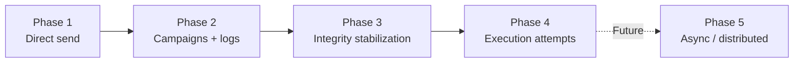
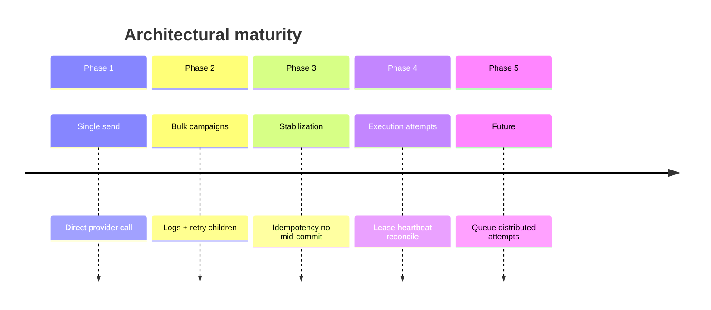
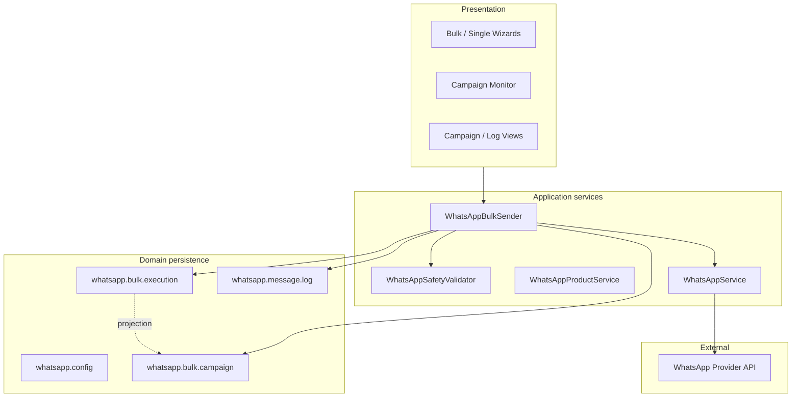
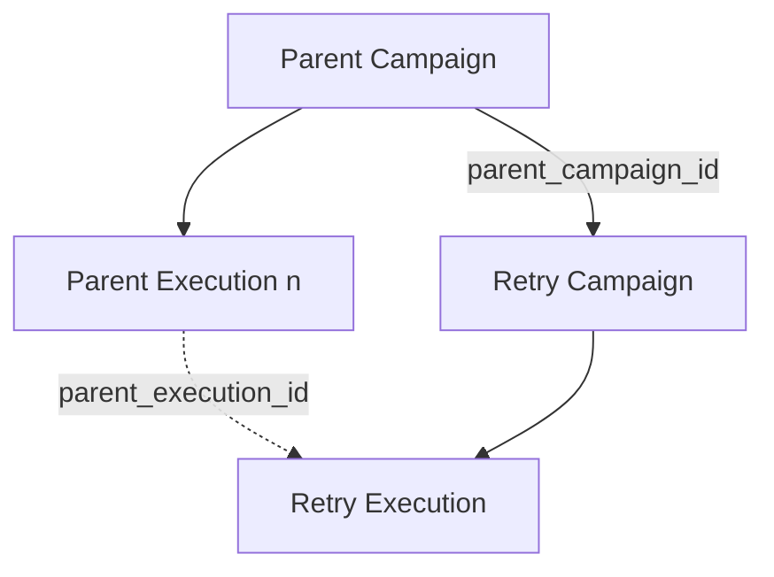
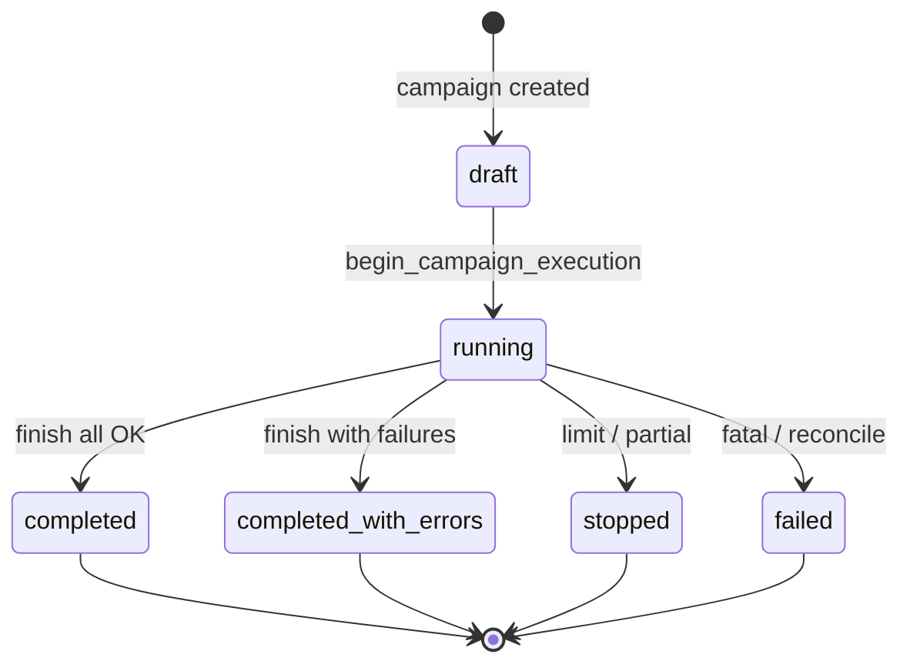
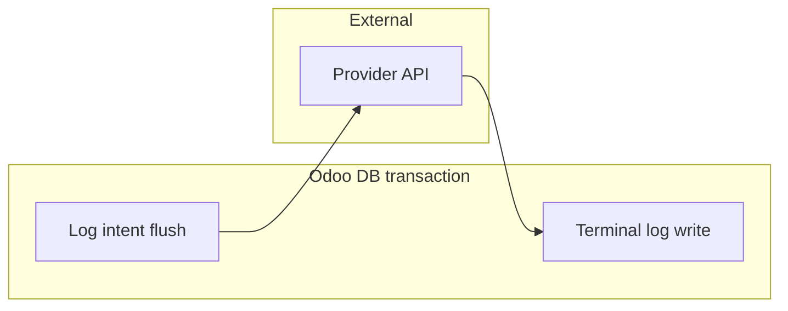
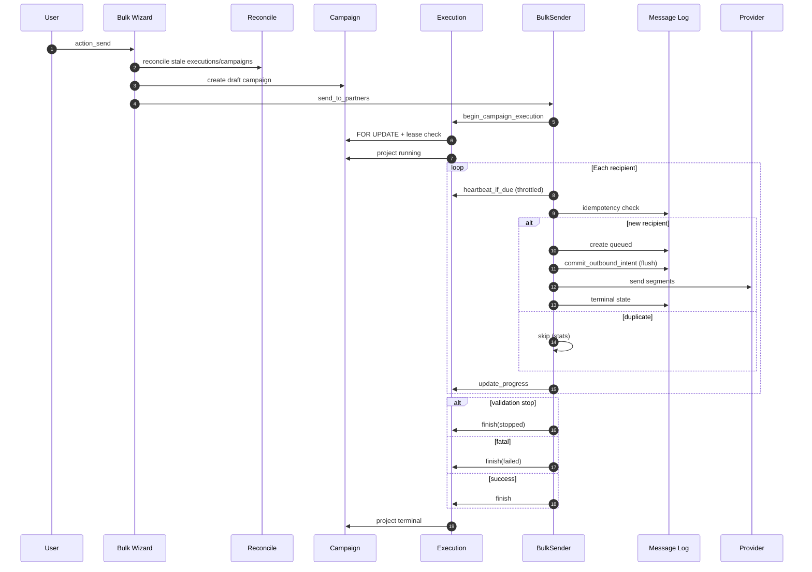
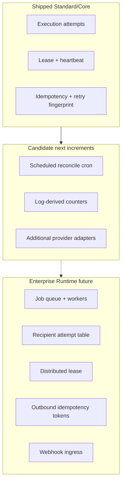

# Product + Runtime Architecture Specification

**Product:** RelayRuntime  
**Odoo module:** `relayruntime` (`apps/odoo/relayruntime/`) — formerly `whatsapp_simple`  
**Document type:** Business Requirements + Runtime Architecture (authoritative)  
**Module version (reference):** `19.0.6.0.0`  
**Status:** Living specification — reflects **implemented** codebase unless explicitly marked *Future*

---

## Table of contents

1. [Executive summary](#1-executive-summary)
2. [Product evolution timeline](#2-product-evolution-timeline)
3. [Runtime architecture (current)](#3-runtime-architecture-current)
4. [Transaction and consistency model](#4-transaction-and-consistency-model)
5. [Execution lifecycle](#5-execution-lifecycle)
6. [Retry and replay semantics](#6-retry-and-replay-semantics)
7. [Runtime safety principles](#7-runtime-safety-principles)
8. [Operational constraints](#8-operational-constraints)
9. [Feature maturity matrix](#9-feature-maturity-matrix)
10. [Product editions strategy](#10-product-editions-strategy)
11. [Documentation cross-references](#11-documentation-cross-references)
12. [Release strategy](#12-release-strategy)
13. [Known architectural limits](#13-known-architectural-limits)
14. [Appendix: original product intent (preserved)](#14-appendix-original-product-intent-preserved)
15. [Operational guarantees and non-guarantees](#15-operational-guarantees-and-non-guarantees)
16. [Future roadmap (explicit)](#16-future-roadmap-explicit)

**Legend**

| Label | Meaning |
|-------|---------|
| **Implemented** | Shipped and used in production code paths |
| **Stabilized** | Implemented with explicit integrity controls (19.0.5.4+) |
| **Partially implemented** | Present but incomplete or best-effort |
| **Future** | Direction only — not in current runtime |

---

## 1. Executive summary

### What the platform is today

**WhatsApp Simple** is a **runtime-aware WhatsApp campaign execution platform** for Odoo 19 Community. It is no longer only a “send message from Contact” integration.

Today the module provides:

- **Outbound** WhatsApp via a provider adapter layer (**Green API** and **Mock Provider** are send-capable).
- **Single-send** and **bulk campaign** flows with delivery logs.
- **Execution attempts** (`whatsapp.bulk.execution`) as the **runtime authority** for each bulk HTTP run.
- **Campaigns** (`whatsapp.bulk.campaign`) as the **business aggregate** and UI projection.
- **Per-recipient logs** (`whatsapp.message.log`) as delivery truth within a campaign scope.
- **Lease + heartbeat** coordination, **stale reconciliation**, **retry lineage**, and **campaign-scoped idempotency**.

**Runtime model:** synchronous execution inside the Odoo HTTP worker handling the user action. There is **no** module-owned background queue or cron-driven bulk worker.

### Why it evolved beyond simple sending

Early product intent (see [Appendix](#14-appendix-original-product-intent-preserved)) targeted manual single sends and basic logs. Operational use introduced:

- Bulk sends with attachments and product catalogs.
- Campaign monitoring and retry of failed recipients.
- **Corruption and inconsistency discovery** under crash, timeout, concurrent retry, and fragmented transactions.
- A **stabilization program** (idempotency, removed mid-loop commits, progress truth, execution attempts).

The platform name in public materials remains *WhatsApp Simple*; the **architectural identity** is *campaign execution with integrity controls*, not a thin REST wrapper.

### Operational positioning

| Dimension | Position |
|-----------|----------|
| Deployment | Odoo 19 Community module; on-prem, Odoo.sh, or Docker — operator-managed |
| Scale | SMB to mid-market **sequential** bulk (tens–low hundreds per request operationally; thousands require architectural change) |
| HA / distributed runtime | **Not provided** in Standard/Core |
| Compliance / consent | Business responsibility; module does not enforce opt-in law |
| Provider SLA | Third-party; module logs outcomes, does not control delivery |

### Intended deployment scale

- **Supported today:** interactive bulk runs initiated by a user, with safety delays and daily limits, on a correctly sized Odoo worker with adequate `limit_time_real`.
- **Not supported today:** fire-and-forget million-recipient campaigns, multi-node coordinated execution, or guaranteed delivery SLAs.

### Target customer profiles

| Profile | Fit |
|---------|-----|
| Odoo sales/support teams sending catalog or follow-ups to contact lists | **Strong** |
| Organizations using Green API (or Mock for QA) on Odoo 19 Community | **Strong** |
| Teams needing inbound WhatsApp inbox or chatbot | **Future / out of scope** |
| Enterprises requiring exactly-once delivery or distributed workers | **Future Enterprise Runtime** — not current OSS |

---

## 2. Product evolution timeline

Chronological maturation of the system. Dates are **release-relative** (see [CHANGELOG.md](CHANGELOG.md)); phases overlap in documentation and memory but represent real architectural shifts.

### Architecture evolution (summary diagram)

### Phase 1 — Basic WhatsApp integration (original intent)

**Status:** Superseded by later phases; **core flows remain**.

| Aspect | State |
|--------|--------|
| Configuration | API URL, token, instance — **Implemented** (via `whatsapp.config`) |
| Single send wizard | Contact / Sale Order — **Implemented** |
| Direct send model | Service calls provider per action — **Implemented** |
| Message logging | Basic recipient, message, status — **Implemented** (extended) |

**Original scope explicitly excluded** campaigns, webhooks, automation (see Appendix). Those exclusions were **later relaxed** for outbound campaigns only; inbound webhooks remain *Future*.

### Phase 2 — Bulk campaigns and observability

**Releases:** ~19.0.3.x – 19.0.4.x (see CHANGELOG)

| Capability | State |
|------------|--------|
| Bulk send wizard, campaign records | **Implemented** |
| Product catalog + product images | **Implemented** |
| Campaign monitor (kanban, periodic reload) | **Implemented** |
| Retry failed recipients (child campaigns) | **Implemented** |
| Provider adapter architecture | **Implemented** (Green API + stubs) |
| Structured loggers, optional file log | **Implemented** |
| Mid-loop `cr.commit()` for progress | **Was implemented** — **removed** in Phase 3 |

### Phase 3 — Corruption discovery and runtime stabilization

**Releases:** ~19.0.5.4.x

**Drivers:** Post-incident analysis — partial durable state, zombie `running` campaigns, false 100% progress, duplicate retries/recipients, provider success with DB rollback.

| Control | State |
|---------|--------|
| Remove mid-execution commits | **Stabilized** |
| Campaign-scoped idempotency key on logs | **Stabilized** |
| Retry fingerprint unique constraint | **Stabilized** |
| Terminal progress from processed counts | **Stabilized** |
| Stale `running` campaign reconciliation | **Stabilized** |
| Outbound intent flush before provider (ORM) | **Partially implemented** |

### Phase 4 — Execution-attempt architecture

**Release:** 19.0.5.5.0 — **Implemented**

| Capability | State |
|------------|--------|
| `whatsapp.bulk.execution` model | **Implemented** |
| Immutable `execution_uuid` per run | **Implemented** |
| Lease + heartbeat | **Implemented** |
| `FOR UPDATE` campaign lock at start | **Implemented** |
| Authority vs projection split | **Implemented** |
| Retry lineage via `parent_execution_id` | **Implemented** |
| Reconciliation on `heartbeat_at` | **Implemented** |

### Phase 5 — Async orchestration and durable recipient attempts (*Future*)

**Not implemented.** Planned direction:

- Background job queue / worker pool for bulk processing.
- Per-recipient attempt table with durable terminalization.
- Distributed execution lease (DB uniqueness across workers).
- Provider outbound idempotency tokens.
- Event-sourced or log-derived aggregate counters.
- Inbound webhook HTTP controllers.

---

## 3. Runtime architecture (current)

### Layered view

### Authority vs projection

| Concern | **Authority (runtime truth)** | **Projection / aggregate** |
|---------|------------------------------|----------------------------|
| Is a bulk run active? | `whatsapp.bulk.execution` state + lease | Campaign `state=running`, `active_execution_id` |
| Executor liveness | `execution.heartbeat_at` | Campaign `last_activity_at` (touch on heartbeat) |
| Per-recipient delivery | `whatsapp.message.log` | Campaign counters at end (from in-memory stats) |
| Retry business definition | Child campaign + fingerprint | Parent logs unchanged |
| Configuration | `whatsapp.config` | — |

**Partially implemented:** campaign counters are **not** recomputed from logs after finish; they reflect sender stats at terminalization.

### Campaign model (`whatsapp.bulk.campaign`)

**Implemented** — business record: recipients, message, attachments, products, user, company, parent/retry linkage.

**States:** `draft`, `running`, `completed`, `completed_with_errors`, `stopped`, `failed`.

**Role:** historical summary, monitor UI, retry source, sale order linkage — **not** the sole runtime lock holder (execution lease is).

### Execution-attempt model (`whatsapp.bulk.execution`)

**Implemented** — one row per actual bulk HTTP run.

| Field group | Purpose |
|-------------|---------|
| `execution_uuid` | Immutable identity |
| `lease_token`, `lease_expires_at` | Concurrency ownership |
| `heartbeat_at`, `last_recipient_index` | Liveness |
| `executor_uid` | Owning user |
| `parent_execution_id`, `attempt_kind` | Retry lineage |
| Counters / progress | In-run stats mirrored to campaign |

**States:** `pending`, `running`, `completed`, `completed_with_errors`, `stopped`, `failed`, `reconciled`.

### Retry lineage (campaign + execution)

- **Campaign level:** `parent_campaign_id`, `retry_fingerprint` (unique per parent + payload).
- **Execution level:** `attempt_kind=retry`, `parent_execution_id` → latest execution on parent campaign.

### Lease ownership

**Implemented**

- Acquired in `begin_campaign_execution()`.
- Extended on heartbeat (15-minute lease window — `EXECUTION_LEASE_MINUTES`).
- Cleared on `finish()` or stale `reconciled`.
- Gate: no second `running` attempt with `lease_expires_at > now` on same campaign.

**Partially implemented:** not a cluster-wide distributed lock; multi-worker behavior requires operational validation.

### Heartbeat lifecycle

**Implemented** (`constants.py`):

| Parameter | Value |
|-----------|-------|
| Every N recipients | 5 |
| Minimum interval | 45 seconds |
| Stale threshold | 30 minutes |

### Reconciliation model

**Implemented**

1. `_reconcile_stale_executions()` — running + aged `heartbeat_at` → `reconciled`.
2. `_reconcile_stale_running_campaigns()` — fallback if campaign stuck without live lease.

Triggered on bulk wizard send, retry action, and execution begin — **not** on a shipped module cron.

### Outbound intent flow

**Partially implemented**

1. Log created `delivery_state=queued`.
2. `commit_outbound_intent()` sets `outbound_intent_at`, promotes to `sending`, **ORM flush** (same transaction).
3. Provider HTTP calls.
4. Terminal log write `sent` / `failed` / `skipped`.

Does **not** commit intent in a separate transaction before provider.

### Operational state model (bulk)

---

## 4. Transaction and consistency model

### Transaction boundaries (implemented)

| Boundary | Behavior |
|----------|----------|
| Bulk wizard `action_send` | Single Odoo HTTP transaction (commit at request success) |
| Mid-loop `cr.commit()` | **Removed** (stabilized) |
| Single-send wizard | Standard request transaction |
| Provider HTTP | **Outside** PostgreSQL transaction |

### Provider non-atomicity (inherent)

WhatsApp delivery is an **external side effect**. PostgreSQL commit does not commit a message to WhatsApp; rollback does not unsend.

### Rollback limitations

| Scenario | Outcome |
|----------|---------|
| Unhandled exception before request end | Full txn rollback — logs may disappear |
| Provider success then rollback | **Duplicate risk** on manual retry |
| Sender catches fatal, calls `finish()`, returns stats | Txn may commit with partial external sends |

**Stabilized:** reduced re-raise after partial provider success; **not eliminated**.

### Duplicate-send mitigation (implemented / partial)

| Mechanism | Scope | Status |
|-----------|-------|--------|
| `idempotency_key` = `campaign:{id}:partner:{id}` | Same campaign | **Stabilized** |
| SQL unique on idempotency | DB | **Stabilized** |
| Retry fingerprint dedup | Same parent + payload | **Stabilized** |
| Execution lease | Same campaign concurrent runs | **Implemented** |
| Provider idempotency token | Provider API | **Future** |
| Cross-campaign dedup | Business-wide | **Not provided** (retry creates new campaign) |

### Long-running transaction tradeoffs

**Accepted in Phase 3–4** to avoid fragmented partial DB state:

- Longer row lock / `FOR UPDATE` hold on campaign during bulk.
- HTTP `limit_time_real` sensitivity.
- ORM memory growth on large recipient sets.

### Idempotency boundaries

- **In scope:** one successful processing path per (campaign, partner) for idempotency key purposes.
- **Out of scope:** exactly-once to WhatsApp; cross-retry-campaign suppression; provider transport retries.

### Runtime durability semantics

| Artifact | Durable when |
|----------|--------------|
| Campaign, execution, logs | HTTP request commits |
| Outbound intent flush | Visible only inside open txn until commit |
| Provider delivery | Independent |

### Explicit non-promises

- **No exactly-once delivery** to recipients.
- **No atomic** DB + provider transaction.
- **No guarantee** that `sending` logs cannot exist after crash (mitigated by reconcile + idempotency on re-run within campaign).

Detail: [docs/architecture/TRANSACTION_MODEL.md](docs/architecture/TRANSACTION_MODEL.md)

---

## 5. Execution lifecycle

### End-to-end sequence

### Phase reference

| Phase | Actions | Status |
|-------|---------|--------|
| **Creation** | Campaign `draft`; execution on send start | **Implemented** |
| **Lease acquisition** | Create execution, set lease, block duplicate live lease | **Implemented** |
| **Heartbeat refresh** | Every 5 recipients / 45s; extend lease | **Implemented** |
| **Recipient processing** | Safety, delays, provider segments | **Implemented** |
| **Retry execution** | New campaign + new execution (`retry`) | **Implemented** |
| **Stale reconciliation** | `reconciled` execution; campaign `failed` projection | **Implemented** |
| **Terminalization** | `execution.finish()` → campaign `_mark_finished` | **Implemented** |
| **Recovery** | Manual retry; reconcile on next entry — no auto-resume mid-run | **Partially implemented** |

Detail: [docs/runtime/EXECUTION_FLOW.md](docs/runtime/EXECUTION_FLOW.md)

---

## 6. Retry and replay semantics

### Retry lineage (implemented)

1. User runs **Retry Failed Recipients** on terminal parent campaign.
2. Failed/skipped logs with partners define recipient set.
3. `retry_fingerprint` = SHA-1(parent id, message, attachment ids, product ids, partner ids).
4. Existing child with same fingerprint → open existing (no duplicate tree).
5. New bulk run → **new** `whatsapp.bulk.execution` with `attempt_kind=retry`, `parent_execution_id` = latest parent execution.

### Deduplication scope

| Layer | Key / rule | Prevents |
|-------|------------|----------|
| Recipient (same campaign) | `campaign:{campaign_id}:partner:{partner_id}` | Double send same campaign |
| Retry campaign | `(parent_campaign_id, retry_fingerprint)` | Duplicate retry trees |
| Concurrent run | Execution lease | Parallel live bulk on same campaign |

### Replay boundaries

| Replay type | Behavior |
|-------------|----------|
| Re-click retry (same fingerprint) | Opens existing retry campaign — **no auto-resend** unless user sends again |
| Second bulk on same campaign | Blocked if valid lease |
| Retry child campaign | **New** campaign id → **may resend** same partner (by design) |
| HTTP rollback after provider success | **May replay** without log — duplicate risk |

### Replay ambiguity mitigation (stabilized / partial)

- Outbound intent + idempotency before provider (within campaign).
- Execution UUID on campaign during run (`execution_token`).
- Reconcile stale runs before new entry.

### Remaining replay limitations

- No provider-level deduplication keys.
- No resume from `last_recipient_index` after crash.
- Fingerprint changes if parent message/products change → new retry campaign allowed.
- `parent_execution_id` points to **latest** parent execution, not necessarily causal execution for each failed log.

Detail: [docs/runtime/RETRY_AND_REPLAY.md](docs/runtime/RETRY_AND_REPLAY.md)

---

## 7. Runtime safety principles

Authoritative rules for engineering (aligned with [docs/development/RUNTIME_SAFETY_RULES.md](docs/development/RUNTIME_SAFETY_RULES.md)).

| Principle | Requirement | Status |
|-----------|-------------|--------|
| **No unsafe commits in loops** | No `cr.commit()` in `WhatsAppBulkSender` recipient loop | **Stabilized** |
| **Execution-attempt authority** | Running truth on `whatsapp.bulk.execution`, not campaign alone | **Implemented** |
| **Replay-safe execution** | Idempotency + fingerprint + lease | **Stabilized** (bounded scope) |
| **Stale execution recovery** | Reconcile aged heartbeat before new runs | **Implemented** |
| **Duplicate-send mitigation** | Campaign-scoped keys; not provider-wide | **Stabilized** |
| **Projection vs truth** | Logs = recipient truth; execution = run truth; campaign = aggregate | **Implemented** |
| **Operational reconciliation** | Manual/shell reconcile documented in runbook | **Implemented** |

### Anti-patterns (forbidden without architecture review)

- Reintroducing mid-loop commits for “progress durability.”
- Setting `campaign.state=running` without `begin_campaign_execution`.
- Bypassing idempotency for “force resend” within same campaign.
- Re-raising exceptions after provider success without compensation design.

---

## 8. Operational constraints

### Runtime assumptions (honest)

| Constraint | Typical dev sample | Production implication |
|------------|-------------------|-------------------------|
| `workers = 0` | Seen in local `odoo.conf` samples | Threaded mode — **not** multi-worker production pattern |
| `limit_time_real` | e.g. 120s | Caps bulk size |
| Synchronous `time.sleep` delays | Inter-recipient, attachment, cooldown | Blocks HTTP worker |
| No bulk cron | — | No automatic stale sweep unless operator triggers send |

### Timeout sensitivity

Bulk duration ≈ recipients × (random delay + segments × provider latency + cooldowns). Exceeding `limit_time_real` aborts the request; external sends may be partial.

### Large campaign limits

| Risk | Cause |
|------|--------|
| HTTP timeout | Long single request |
| Memory | Partner batch, attachment cache, ORM identity map |
| Lock duration | `FOR UPDATE` + frequent writes |

**Operational guidance:** size campaigns conservatively; use Mock for stress discovery.

### Provider-side unpredictability

- Timeouts, rate limits, partial multi-segment success.
- No module control over provider retries.
- **Green API** production; **Mock** for QA; other adapters **stub only**.

Detail: [docs/deployment/PRODUCTION_CHECKLIST.md](docs/deployment/PRODUCTION_CHECKLIST.md)

---

## 9. Feature maturity matrix

### A. Currently implemented

| Feature | Notes |
|---------|--------|
| Single-send wizard | Contact, Sale Order |
| Bulk-send wizard | Attachments, products, catalog |
| `whatsapp.config` | Safety limits, provider selection |
| Green API provider | Production outbound |
| Mock provider | Simulated sends |
| Campaign states + monitor | 5s kanban reload |
| Message logs + dashboard | Delivery states, failures |
| Retry failed recipients | Child campaigns |
| Campaign-scoped idempotency | Unique SQL |
| Retry fingerprint dedup | Unique SQL |
| No mid-loop commits | Bulk path |
| Execution attempts | 19.0.5.5.0 |
| Lease + heartbeat | Constants-driven |
| Stale reconciliation | On entry + execution begin |
| Outbound intent flush | ORM flush before provider |
| Product → SO wizard | Manual selection |
| Multi-company rules | Config, campaign, logs |
| Security groups | User / Manager |
| Repository docs + CI hygiene | `/docs`, GitHub templates |

### B. Partially implemented

| Feature | Gap |
|---------|-----|
| Outbound intent durability | Flush only — same transaction |
| Multi-worker execution safety | Lease + row lock — not fully proven distributed |
| Campaign counters | In-memory at finish — not log-derived |
| `delivered` log state | Field exists — outbound rarely sets |
| Daily limit counting | Uses legacy `status='sent'` |
| Progress during attachments | Campaign projection throttled |
| Webhook router | Code skeleton — **no HTTP** |
| Provider stubs in UI | Selectable — not send-capable |
| Attachment lifecycle | Reuse by binary match — no ownership table |
| Automated stale cron | Reconcile on user actions only |

### C. Future / planned

| Feature | Target phase |
|---------|--------------|
| Background queue / cron worker | Phase 5 |
| Per-recipient attempt table | Phase 5 |
| Distributed execution lease (DB uniqueness) | Phase 5 / Enterprise |
| Provider outbound idempotency | Phase 5 |
| Event-sourced / log-derived counters | Phase 5 |
| Inbound webhook controllers | Phase 5 |
| Savepoint-per-recipient commit policy | Architectural decision |
| Transactional outbox | Enterprise direction |
| Meta / Evolution / etc. adapters | Product backlog |
| Inbox, chatbot, AI, scheduling | Out of original scope — still future |

---

## 10. Product editions strategy

### Core / Standard (current open-source module)

**Status:** **Implemented** — this repository.

| Included | Excluded |
|----------|----------|
| Synchronous bulk + single send | Distributed HA runtime |
| Execution attempts, lease, heartbeat | Guaranteed SLA on delivery |
| Retry + reconciliation hooks | 24/7 managed ops |
| Green API + Mock | Enterprise observability stack |
| Full `/docs` operational honesty | Exactly-once semantics |

**Target:** SMB Odoo teams with operator-managed infrastructure.

### Enterprise Runtime (*Future* — not shipped)

**Status:** **Future** — separate product direction; **not** in current codebase.

Planned differentiation:

| Capability | Intent |
|------------|--------|
| Distributed execution | Worker pool, cross-node lease |
| Durable recipient attempts | Append-only attempt rows, terminalization |
| Reconciliation engine | Scheduled stale repair, counter rebuild |
| Advanced observability | Metrics, tracing, alert hooks |
| HA coordination | `FOR UPDATE NOWAIT`, partial unique indexes |
| Consulting / SLA | Operational ownership model TBD |

**Important:** Enterprise features must not be documented or sold as present in Standard/Core 19.0.5.5.0.

---

## 11. Documentation cross-references

| Topic | Document |
|-------|----------|
| Master index | [docs/README.md](docs/README.md) |
| System overview | [docs/architecture/SYSTEM_OVERVIEW.md](docs/architecture/SYSTEM_OVERVIEW.md) |
| Data model | [docs/architecture/DATA_MODEL.md](docs/architecture/DATA_MODEL.md) |
| Transactions | [docs/architecture/TRANSACTION_MODEL.md](docs/architecture/TRANSACTION_MODEL.md) |
| Execution runtime | [docs/architecture/EXECUTION_RUNTIME.md](docs/architecture/EXECUTION_RUNTIME.md) |
| Known limitations | [docs/architecture/KNOWN_LIMITATIONS.md](docs/architecture/KNOWN_LIMITATIONS.md) |
| Execution flow | [docs/runtime/EXECUTION_FLOW.md](docs/runtime/EXECUTION_FLOW.md) |
| Retry / replay | [docs/runtime/RETRY_AND_REPLAY.md](docs/runtime/RETRY_AND_REPLAY.md) |
| Leases / heartbeat | [docs/runtime/HEARTBEAT_AND_LEASES.md](docs/runtime/HEARTBEAT_AND_LEASES.md) |
| Outbound intents | [docs/runtime/OUTBOUND_INTENTS.md](docs/runtime/OUTBOUND_INTENTS.md) |
| Deployment | [docs/deployment/](docs/deployment/LOCAL_SETUP.md) |
| Testing | [docs/testing/TESTING_STRATEGY.md](docs/testing/TESTING_STRATEGY.md) |
| Operations | [docs/operations/RUNBOOK.md](docs/operations/RUNBOOK.md) |
| Safety rules | [docs/development/RUNTIME_SAFETY_RULES.md](docs/development/RUNTIME_SAFETY_RULES.md) |
| Providers | [docs/PROVIDER_ARCHITECTURE.md](docs/PROVIDER_ARCHITECTURE.md) |
| Public README | [README.md](README.md) |
| Security | [SECURITY.md](SECURITY.md) |
| Support scope | [SUPPORT.md](SUPPORT.md) |
| Changelog | [CHANGELOG.md](CHANGELOG.md) |

**This BRD** is the **product + runtime** authority; `/docs` is the **operational and engineering** depth. On conflict, **code + CHANGELOG** win; update BRD on intentional release changes.

---

## 12. Release strategy

### Stabilization-first approach

Priority order (observed 19.0.5.x):

1. **Integrity** — transactions, idempotency, execution authority.
2. **Observability** — logs, execution tab, reconciliation.
3. **Features** — new providers, inbound, queue — only after runtime validation.

### Release freeze policy (recommended)

- **Patch** (`19.0.5.5.x`): safety fixes, doc, CI — no semantic runtime change without review.
- **Minor** (`19.0.5.x.0`): stabilization or execution model changes — full regression on Mock bulk/retry/reconcile.
- **No** marketing of Phase 5 capabilities until merged and documented as **Implemented**.

### Runtime validation before feature expansion

Required before merging runtime-affecting PRs:

- `python scripts/ci_validate.py`
- Mock provider bulk + retry + duplicate-click retry
- Stale reconciliation scenario (see [docs/testing/RUNTIME_FAILURE_TESTS.md](docs/testing/RUNTIME_FAILURE_TESTS.md))

Full Odoo integration tests — **partial** coverage today; manual QA required.

### Semantic versioning (module)

Format: `19.0.MAJOR.MINOR.PATCH` (Odoo 19 series).

See [docs/releases/VERSIONING.md](docs/releases/VERSIONING.md), [docs/releases/RELEASE_PROCESS.md](docs/releases/RELEASE_PROCESS.md).

---

## 13. Known architectural limits

### Remaining consistency gaps

| Gap | Severity |
|-----|----------|
| Provider success + HTTP rollback | High for duplicates |
| `sending` logs if kill before terminal write | Medium |
| Retry campaign resends same partner | Medium (by design) |
| Counters vs logs drift mid-run | Low–medium |
| No cron reconcile | Medium for abandoned runs |

### Unavoidable provider limitations

- External API outside DB ACID.
- Multi-segment per recipient partial success.
- Vendor rate limits and outages.

### Scalability boundaries (current)

- Sequential in-process loop.
- Single HTTP transaction per bulk attempt.
- Blocking sleeps on worker thread.

### Unresolved future architecture needs

- Async orchestration and checkpointing.
- Log-derived aggregates.
- Cross-campaign business deduplication policy.
- Inbound message architecture.
- Legal/consent workflow automation.

Detail: [docs/architecture/KNOWN_LIMITATIONS.md](docs/architecture/KNOWN_LIMITATIONS.md)

---

## 14. Appendix: original product intent (preserved)

The following content is **retained from the initial PRD** (Phase 1). Items marked “out of scope” were **later extended** only where noted in the evolution timeline (outbound campaigns). **Do not** interpret this appendix as the current feature boundary.

### Original project overview

Build a lightweight WhatsApp integration module for Odoo 19 Community that allows users to send WhatsApp messages directly from Odoo business documents. The first version focused on **outgoing messages only**.

### Original goals

- Send WhatsApp messages from Odoo
- Keep implementation simple
- Support manual sending only
- Provide basic message tracking
- Ensure clean modular architecture

### Original in-scope (still valid where not superseded)

| Area | Original | Current |
|------|----------|---------|
| Configuration | API URL, token, instance, active | **Implemented** (+ provider types) |
| Models | `res.partner`, `sale.order` | **Implemented** |
| Send wizard | Recipient, message, attachment | **Implemented** (+ bulk wizard) |
| API | Text, media, errors | **Implemented** via adapters |
| Logs | Recipient, message, status, API, user, date | **Implemented** (extended fields) |
| Security | User / Manager groups | **Implemented** |

### Original explicit out-of-scope (historical)

The following were **NOT** in the first version:

- Incoming messages
- Webhooks
- Live chat
- **Campaigns** → **Later added** (outbound bulk only)
- Automation
- AI replies / chatbot
- Multi-agent inbox
- Message templates
- Scheduling

### Original technical stack

- Odoo 19 Community, Python, REST API, PostgreSQL — **unchanged**.

### Original module structure (simplified)

`models/`, `wizard/`, `services/`, `security/`, `views/` — **expanded** with `whatsapp.bulk.execution`, `providers/`, `docs/`, tests.

---

## 15. Operational guarantees and non-guarantees

### What Standard/Core operationally provides

| Guarantee class | Statement |
|-----------------|-----------|
| **Integrity controls (bounded)** | Campaign-scoped idempotency; retry fingerprint dedup; execution lease for concurrent starts; stale heartbeat reconciliation |
| **Auditability** | Per-recipient logs with delivery state, failure reason, optional API metadata |
| **Transparency** | Documented limitations; no hidden mid-loop commits in bulk path |
| **Testability** | Mock provider for non-production validation |

### What is NOT guaranteed

| Non-guarantee | Explanation |
|---------------|-------------|
| **Exactly-once delivery** | WhatsApp is external; retries and rollbacks can duplicate |
| **Atomic send + DB commit** | Two-phase commit does not exist |
| **Completion within timeout** | Operator must size campaigns vs `limit_time_real` |
| **Automatic recovery without user action** | Reconcile runs on next send entry, not continuous cron |
| **Multi-worker correctness without testing** | Lease is best-effort across processes |
| **Provider uptime or deliverability** | Third-party SLA |
| **Regulatory compliance** | Opt-in / marketing law is customer responsibility |

### Support boundary

See [SUPPORT.md](SUPPORT.md) and [SECURITY.md](SECURITY.md).

---

## 16. Future roadmap (explicit)

**None of the following is implemented in 19.0.5.5.0.** Priority is indicative, not a commitment.

| Initiative | Edition | Status |
|------------|---------|--------|
| Scheduled stale reconciliation | Standard | **Future** |
| Log-derived campaign counters | Standard | **Future** |
| Meta Cloud / Evolution adapters | Standard | **Future** |
| Background bulk worker | Enterprise | **Future** |
| Durable recipient attempts | Enterprise | **Future** |
| HA multi-worker execution | Enterprise | **Future** |
| Inbound webhooks + inbox | Enterprise / later Standard TBD | **Future** |

---

## Document control

| Field | Value |
|-------|--------|
| Replaces | Early PRD “WhatsApp Simple Integration” (Phase 1 only) |
| Audience | Product, engineering, operations, support |
| Review trigger | Any change to execution model, idempotency, or transaction boundaries |
| Canonical version | Matches `__manifest__.py` at release tag |

---

*End of specification.*
