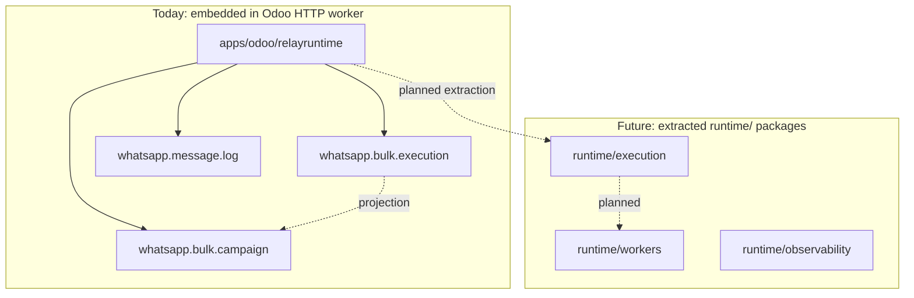
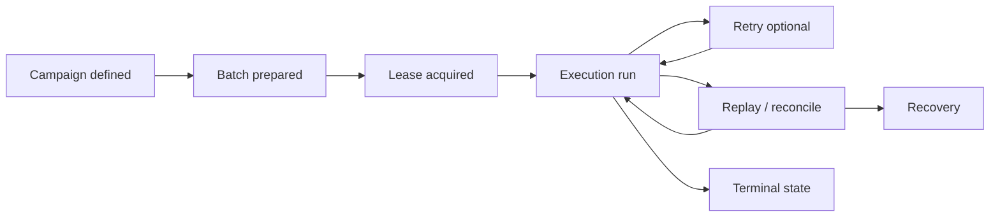

# RelayRuntime

**A replay-safe operational messaging execution runtime, initially delivered as an Odoo application.**

RelayRuntime coordinates outbound messaging campaigns with execution lineage, lease-aware concurrency, and recovery-oriented persistence. It exists to make operational messaging **correct under failure**, not merely to invoke a provider API from ERP forms.

| | |
|---|---|
| **Odoo module** | `relayruntime` (`apps/odoo/relayruntime/`) |
| **Platform** | Odoo 19 Community |
| **Delivery model today** | Embedded synchronous runtime (HTTP worker) |
| **License** | LGPL-3.0 |

[Documentation](docs/README.md) · [Migration](MIGRATION.md) · [Contributing](CONTRIBUTING.md) · [Security](SECURITY.md)

---

## Why RelayRuntime exists

Operational messaging breaks in predictable ways when treated as a simple “send button”:

| Failure class | Symptom |
|---------------|---------|
| **Duplicate execution** | Same recipient contacted twice after retries, rollbacks, or concurrent runs |
| **Unsafe retries** | Child campaigns or replays without lineage or deduplication scope |
| **Replay inconsistency** | Database state does not reflect what the provider already accepted |
| **Attachment coordination** | Multi-segment sends fail mid-flight; partial success is hard to reason about |
| **Weak operational visibility** | Stuck `running` campaigns, unclear execution ownership, no durable attempt identity |

RelayRuntime introduces an **execution-attempt authority** (`whatsapp.bulk.execution`), campaign-scoped idempotency, retry fingerprinting, lease/heartbeat liveness, and documented recovery paths—within the limits of synchronous Odoo execution and external provider APIs.

---

## Core runtime principles

| Principle | Meaning in this repository |
|-----------|----------------------------|
| **Replay-safe execution** | Reconcile stale attempts; persist outbound intent before provider I/O; bounded idempotency keys |
| **Lease-aware coordination** | One live execution lease per campaign attempt; heartbeat extends ownership |
| **Execution lineage** | Immutable `execution_uuid`; retry attempts link via `parent_execution_id` |
| **Operational observability** | Execution tab, message logs, structured loggers, campaign monitor (partial—no metrics platform) |
| **Runtime-safe recovery** | Stale reconciliation on entry; operator runbook; no silent “success” on partial failure |

These principles do **not** imply exactly-once delivery to end recipients. See [Security](SECURITY.md).

---

## Architecture overview



| Layer | Path | Responsibility |
|-------|------|----------------|
| **Odoo orchestration** | `apps/odoo/relayruntime/` | ERP models, UI, wizards, ACL, provider config, send entrypoints |
| **Runtime logic (transitional)** | Same addon (`models/`, `services/`) | Execution lifecycle, lease, bulk orchestration—**moving to `runtime/`** |
| **Extraction placeholders** | `runtime/*` | Package boundaries only; no standalone service yet |

Detail: [docs/architecture/runtime-boundaries.md](docs/architecture/runtime-boundaries.md) · [docs/architecture/runtime-vision.md](docs/architecture/runtime-vision.md)

---

## Execution lifecycle

Conceptual lifecycle (terms used across docs):



| Stage | Status today |
|-------|----------------|
| Campaign creation | **Implemented** (`whatsapp.bulk.campaign`) |
| Queue / async batching | **Not implemented** — sequential loop in HTTP request |
| Lease acquisition | **Implemented** (`begin_campaign_execution`) |
| Execution | **Implemented** (`WhatsAppBulkSender`) |
| Retry | **Implemented** (child campaign + fingerprint) |
| Replay / reconcile | **Partial** (stale heartbeat; no auto-resume) |
| Recovery | **Operational** (runbook + manual retry) |
| Completion | **Implemented** (`execution.finish`) |

Detail: [docs/architecture/execution-lifecycle.md](docs/architecture/execution-lifecycle.md)

---

## Failure recovery philosophy

RelayRuntime optimizes for **operational correctness** over optimistic UX:

- **Idempotent thinking** at campaign/recipient boundaries—not global exactly-once.
- **Durable attempt identity** so operators can distinguish runs.
- **Explicit terminal states** (`completed`, `stopped`, `failed`, `reconciled`) instead of forced 100% progress.
- **Honest partial failure** when daily limits or provider errors stop a batch.

Recovery is **operator-assisted** today: reconcile stale executions, inspect logs, retry failed recipients. Automated replay engines and queue workers are **future** work.

Detail: [docs/recovery/replay-recovery.md](docs/recovery/replay-recovery.md)

---

## Repository structure

```
relayruntime/                    # repository root
├── apps/odoo/relayruntime/      # Odoo application (installable module)
├── runtime/                     # extraction boundaries (placeholders)
│   ├── execution/
│   ├── retry/
│   ├── replay/
│   ├── observability/
│   └── workers/
├── docs/                        # engineering reference
├── scripts/                     # CI validation
├── tests/                       # pointer; Odoo tests in addon
├── infrastructure/              # future IaC placeholder
├── demos/                       # future scenarios
├── .github/                     # issue templates, CI
├── README.md
├── MIGRATION.md
├── CONTRIBUTING.md
├── SECURITY.md
└── SUPPORT.md
```

---

## Current runtime scope

| Attribute | Today |
|-----------|--------|
| Deployment | **Embedded** in Odoo process |
| Concurrency | Lease + row lock; **not** distributed HA |
| Transaction | Single HTTP transaction per bulk run |
| Workers / queue | **Not implemented** |
| Provider scope | Green API + Mock send-capable; other adapters stub |
| Exactly-once | **Not provided** |

Detail: [docs/deployment/embedded-runtime.md](docs/deployment/embedded-runtime.md)

---

## Roadmap

| Phase | Description | Status |
|-------|-------------|--------|
| **Embedded runtime** | Odoo addon owns execution authority | **Current** |
| **Isolated workers** | Background consumers for bulk segments | Future |
| **Queue separation** | Decouple HTTP request from execution duration | Future |
| **Runtime services** | Extracted libraries or sidecar processes | Future |
| **Cloud runtime** | Managed execution plane (undefined product) | Future |

Detail: [docs/architecture/runtime-vision.md](docs/architecture/runtime-vision.md) · [docs/deployment/deployment-evolution.md](docs/deployment/deployment-evolution.md)

---

## Installation

### 1. Addons path

Point Odoo at **`apps/odoo`** inside this repository—not the repository root.

```ini
addons_path = /path/to/odoo/addons,/path/to/relayruntime/apps/odoo
```

See [apps/odoo/README.md](apps/odoo/README.md).

### 2. Install module

```bash
odoo-bin -c odoo.conf -d YOUR_DB -i relayruntime
```

### 3. Upgrade

```bash
odoo-bin -c odoo.conf -d YOUR_DB -u relayruntime
```

### 4. Validate

- Assign WhatsApp User / Manager groups.
- Configure **WhatsApp → Settings**; use **Mock Provider** on non-production databases.
- Run a small bulk campaign; confirm **Executions** tab on campaign form.

Upgrading from `whatsapp_simple`? Read [MIGRATION.md](MIGRATION.md) before production.

---

## Odoo compatibility

| Requirement | Version |
|-------------|---------|
| Odoo | 19.0 Community |
| Module series | `19.0.x.y.z` (see `__manifest__.py`) |
| Dependencies | `base`, `sale`, `mail`, `product` |

---

## Contribution

Contributors are expected to understand **runtime boundaries** and **recovery semantics**. Read [CONTRIBUTING.md](CONTRIBUTING.md) and [docs/development/RUNTIME_SAFETY_RULES.md](docs/development/RUNTIME_SAFETY_RULES.md) before changing execution paths.

```bash
python scripts/ci_validate.py
```

---

## License

LGPL-3.0 — see [LICENSE](LICENSE).
