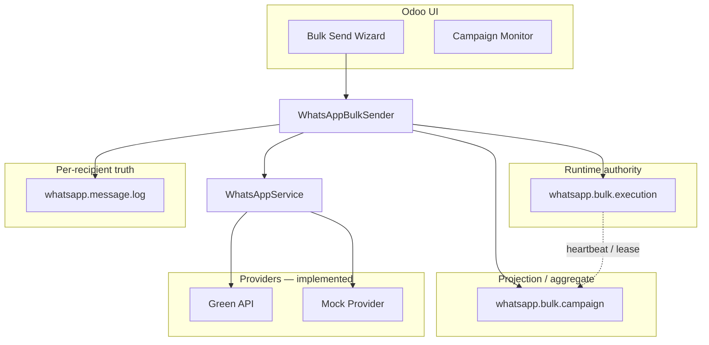

# WhatsApp Simple

**Runtime-aware WhatsApp campaign execution platform for Odoo 19 Community**

[](LICENSE)
[](https://www.odoo.com/)
[](CHANGELOG.md)

Outbound WhatsApp campaigns with **execution attempts**, **lease-based concurrency**, **retry lineage**, and **documented integrity boundaries** — built as an Odoo module, not a thin API wrapper.

| | |
|---|---|
| **License** | LGPL-3.0 |
| **Odoo** | 19.0 Community |
| **Status** | Production-oriented Standard/Core; see [limitations](#known-limitations) |
| **Docs** | [`docs/README.md`](docs/README.md) |

---

## Overview

WhatsApp Simple orchestrates bulk and single sends from Odoo while separating:

- **Runtime authority** — `whatsapp.bulk.execution` (lease, heartbeat, per-run UUID)
- **Business aggregate** — `whatsapp.bulk.campaign` (configuration, UI, retry tree)
- **Recipient truth** — `whatsapp.message.log` (delivery state, idempotency)

Providers are pluggable; **Green API** and **Mock Provider** are send-capable today. Other adapters are registered stubs.

> **Not a guarantee of exactly-once delivery.** Provider APIs are external; see [SECURITY.md](SECURITY.md) and [Known Limitations](docs/architecture/KNOWN_LIMITATIONS.md).

---

## Architecture



| Principle | Implementation |
|-----------|----------------|
| Synchronous bulk | One HTTP request per wizard run (no module queue) |
| No mid-loop commits | Single transaction per bulk attempt |
| Idempotency | `campaign:{id}:partner:{id}` unique on logs |
| Retry dedup | SHA-1 fingerprint per parent + payload |
| Stale recovery | Reconcile executions with aged heartbeat |

Deep dive: [System Overview](docs/architecture/SYSTEM_OVERVIEW.md)

---

## Execution-attempt model

Each bulk run creates one **`whatsapp.bulk.execution`** row:

| Field / concept | Role |
|-----------------|------|
| `execution_uuid` | Immutable identity for the run |
| `lease_token` / `lease_expires_at` | Blocks concurrent live runs on same campaign |
| `heartbeat_at` | Liveness for stale reconciliation |
| `parent_execution_id` | Retry lineage to parent campaign’s latest execution |
| `attempt_kind` | `initial` or `retry` |

Campaign counters at finish are projected from in-memory stats (not log-derived — see docs).

---

## Lease and heartbeat runtime

| Constant | Value |
|----------|-------|
| Lease extension | 15 minutes |
| Stale threshold | 30 minutes without heartbeat |
| Heartbeat | Every 5 recipients or ≥45s |

Before start: `FOR UPDATE` on campaign + reject if another valid lease exists.

Details: [Heartbeat and Leases](docs/runtime/HEARTBEAT_AND_LEASES.md)

---

## Retry and reconciliation

- **Retry Failed Recipients** → child campaign + new execution (`attempt_kind=retry`)
- **Fingerprint dedup** → same parent + same payload opens existing retry campaign
- **Reconciliation** → stale `running` executions → `reconciled`; campaign may project `failed`

Details: [Retry and Replay](docs/runtime/RETRY_AND_REPLAY.md) · [Runbook](docs/operations/RUNBOOK.md)

---

## Feature matrix

| Capability | Status |
|------------|--------|
| Bulk / single send wizards | Implemented |
| Execution attempts + lease + heartbeat | Implemented |
| Campaign-scoped idempotency | Implemented |
| Retry fingerprint deduplication | Implemented |
| Outbound intent flush before provider | Partial (ORM flush, same txn) |
| Campaign monitor (5s kanban reload) | Implemented |
| Green API provider | Implemented |
| Mock provider (test mode) | Implemented |
| Meta / Evolution / UltraMsg / Twilio / Gupshup / Custom | Stub only |
| Inbound webhook HTTP | Planned (skeleton only) |
| Background queue / cron worker | Planned |
| Event-sourced counters | Planned |
| Exactly-once delivery | **Not provided** |

---

## Known limitations

| Topic | Summary |
|-------|---------|
| Long HTTP transaction | Large campaigns risk timeout and lock duration |
| Provider vs database | Send cannot be rolled back with Odoo txn |
| Retry campaigns | New campaign id → may resend same partner |
| Multi-worker | Lease + row lock partial; not full distributed HA |
| Daily limit | Counts legacy `status='sent'` on logs |

Full list: [docs/architecture/KNOWN_LIMITATIONS.md](docs/architecture/KNOWN_LIMITATIONS.md)

---

## Quick start

```bash
# 1. Add module to addons_path
# 2. Install on Odoo 19
odoo-bin -c odoo.conf -d YOUR_DB -i whatsapp_simple

# 3. Upgrade after pull
odoo-bin -c odoo.conf -d YOUR_DB -u whatsapp_simple
```

1. Assign **WhatsApp User** or **WhatsApp Manager**.
2. **WhatsApp → Settings** → **Mock Provider** (QA) or **Green API** (live).
3. **Contacts** → select → **WhatsApp Bulk Send**.

[Local Setup](docs/deployment/LOCAL_SETUP.md) · [Production Checklist](docs/deployment/PRODUCTION_CHECKLIST.md)

---

## Documentation

| Section | Entry |
|---------|-------|
| Product + runtime spec (BRD) | [BRD_WhatsApp_Integration.md](BRD_WhatsApp_Integration.md) |
| Master index | [docs/README.md](docs/README.md) |
| Architecture | [docs/architecture/SYSTEM_OVERVIEW.md](docs/architecture/SYSTEM_OVERVIEW.md) |
| Runtime | [docs/runtime/EXECUTION_FLOW.md](docs/runtime/EXECUTION_FLOW.md) |
| Operations | [docs/operations/RUNBOOK.md](docs/operations/RUNBOOK.md) |
| Development | [docs/development/RUNTIME_SAFETY_RULES.md](docs/development/RUNTIME_SAFETY_RULES.md) |
| Providers | [docs/PROVIDER_ARCHITECTURE.md](docs/PROVIDER_ARCHITECTURE.md) |

---

## Deployment summary

| Environment | Notes |
|-------------|-------|
| Local / on-prem | See `limit_time_real`, prefer `workers > 0` in production |
| Odoo.sh | [docs/deployment/ODOO_SH_DEPLOYMENT.md](docs/deployment/ODOO_SH_DEPLOYMENT.md) |
| Docker | Standard Odoo image + mount module; same timeout caveats |

Configuration lives in **`whatsapp.config`** (database), not environment variables — see [ENVIRONMENT_VARIABLES.md](docs/deployment/ENVIRONMENT_VARIABLES.md).

---

## Operational boundaries

| You manage | Module provides |
|------------|-----------------|
| Odoo uptime, workers, timeouts | Sequential sender + safety delays |
| Provider account & compliance | Adapter + logging |
| Campaign sizing | Idempotency + lease + reconcile hooks |
| Backup / restore | Standard Odoo models |

Support scope: [SUPPORT.md](SUPPORT.md) · Security: [SECURITY.md](SECURITY.md)

---

## Support matrix

| Channel | Use for |
|---------|---------|
| [GitHub Issues](.github/ISSUE_TEMPLATE/) | Bugs, deployment, runtime, duplicate sends |
| [Documentation](docs/README.md) | How it works, limitations, procedures |
| [SECURITY.md](SECURITY.md) | Vulnerability reports (private) |
| Enterprise runtime (queue, HA, SLA) | **Not included** in OSS — see [SUPPORT.md](SUPPORT.md) |

---

## Release and versioning

- **Scheme:** `19.0.x.y.z` (Odoo 19 module series)
- **Current:** `19.0.5.5.0` — see [CHANGELOG.md](CHANGELOG.md)
- **Process:** [docs/releases/RELEASE_PROCESS.md](docs/releases/RELEASE_PROCESS.md)

```bash
# CI validation (local)
python scripts/ci_validate.py
```

---

## Contributing

[docs/development/CONTRIBUTING.md](docs/development/CONTRIBUTING.md) · [Pull request template](.github/PULL_REQUEST_TEMPLATE.md)

---

## Odoo App Store

Store listing assets: [`static/description/`](static/description/) — see [ASSETS_README.md](static/description/ASSETS_README.md) before submission.

---

## Legacy documentation

- [docs/ARCHITECTURE.md](docs/ARCHITECTURE.md) — superseded by `docs/architecture/`
