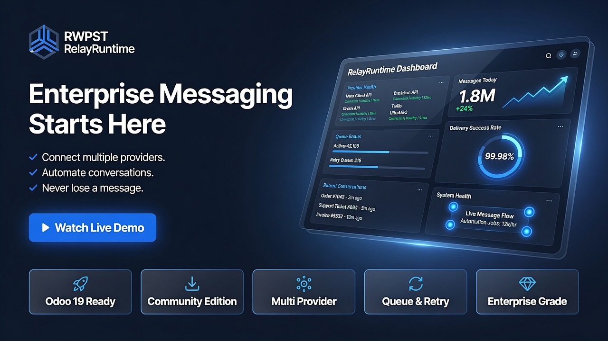
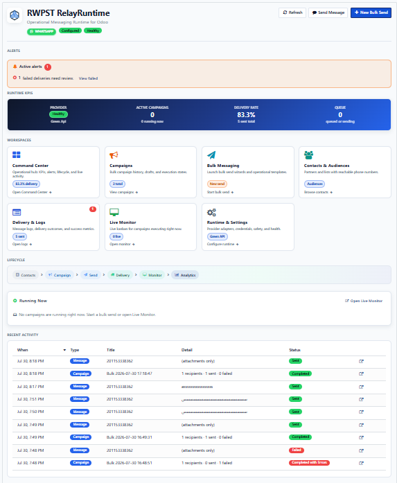
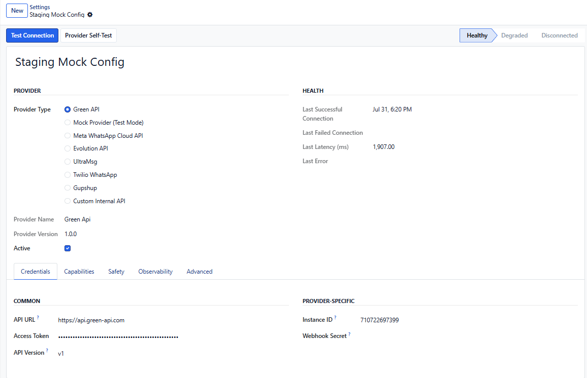
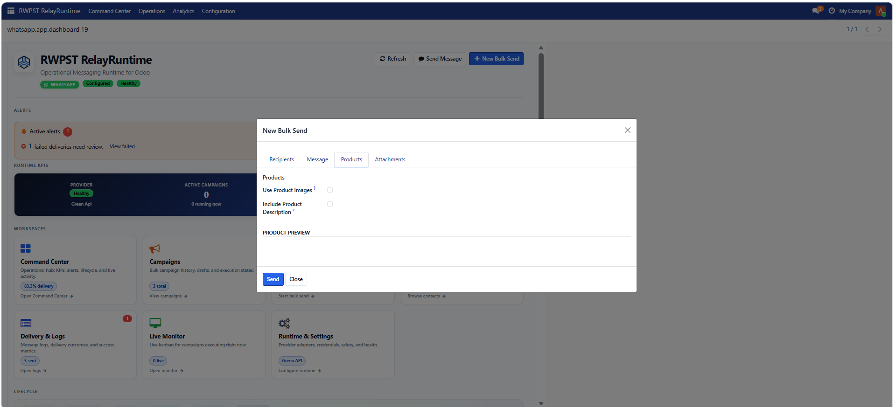
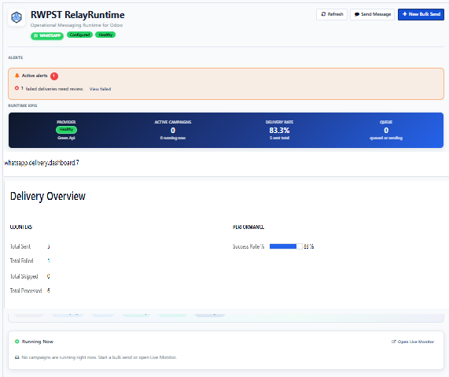

<div align="center">


<br/><br/>



# RelayRuntime

### Enterprise Messaging Runtime for Odoo Community

Built around a runtime — not just an integration.

<br/>

[](https://www.odoo.com)
[](https://www.odoo.com)
[](LICENSE)
[](CHANGELOG.md)
[](https://www.python.org)
[](CHANGELOG.md)

<br/>

[Landing Page](landing-page/) · [Documentation](docs/README.md) · [Release Notes](CHANGELOG.md) · [Odoo Apps](https://apps.odoo.com/apps/modules/browse?search=RelayRuntime)

</div>

---

## Overview

RelayRuntime is an **Enterprise Messaging Runtime** for Odoo Community.

It places a production-ready messaging layer between Odoo and messaging providers — with provider abstraction, queue-oriented execution, retry policies, delivery monitoring, and an Operational Command Center.

Business workflows stay independent of any single provider. Reliability, recovery, and observability live in the runtime.

Enterprise messaging starts here.

---

## Why RelayRuntime

| Traditional Connector | RelayRuntime |
|---|---|
| Single provider dependency | Provider abstraction |
| Fire-and-forget sends | Queue & retry engine |
| Manual recovery | Replay-safe runtime |
| Basic message logs | Operational Command Center |
| Provider-specific workflows | Provider-independent business logic |
| Demo-ready behavior | Production-ready execution |

```text
Enterprise Messaging Runtime
            │
            ▼
 Operational Command Center
            │
            ▼
    Provider Abstraction
            │
            ▼
   Messaging Providers
```

---

## Key Features

| | |
|---|---|
| **Operational Command Center** | Manage KPIs, campaigns, queues, logs, and runtime health from one dashboard. |
| **Provider Abstraction** | Switch providers without rewriting business logic. |
| **Queue & Retry** | Process outbound messaging with structured retry policies. |
| **Campaign Engine** | Run durable campaigns with execution lineage and recovery paths. |
| **Delivery Dashboard** | Inspect delivery outcomes and message-level operational detail. |
| **Live Monitor** | Observe active campaign execution as it runs. |
| **Runtime Settings** | Configure providers and runtime behavior in one place. |
| **Analytics** | Track delivery performance and runtime KPIs. |
| **Attachment Support** | Coordinate outbound messaging with attachments and catalogs. |
| **Enterprise Architecture** | Separate ERP workflows, runtime control, and provider adapters. |

---

## Screenshots

### Command Center



### Runtime Settings



### Bulk Messaging



### Delivery Dashboard



---

## Architecture

```text
                 Business Logic
                       │
                       ▼
                 RelayRuntime
                       │
                       ▼
                Provider Adapter
                       │
       ┌───────┬───────┼───────┬───────┬───────┐
       ▼       ▼       ▼       ▼       ▼       ▼
     Meta    Green  Evolution UltraMsg Twilio Gupshup
            Cloud API   API
```

RelayRuntime isolates Odoo workflows from provider implementations.

Replace providers. Never rewrite workflows.

---

## Installation

```bash
git clone https://github.com/nagwagabr-rwpst/odoo-whatsapp-platform.git
```

1. Add the repository path to Odoo `addons_path`.
2. Restart Odoo.
3. Update the Apps list.
4. Install **RWPST RelayRuntime**.

Installable module: `relayruntime/`

---

## Quick Start

1. Open **RelayRuntime** after installation.
2. Configure a provider under **Runtime Settings**.
3. Validate with Mock Provider or a live adapter.
4. Launch a bulk campaign from the Command Center.
5. Track results in the Delivery Dashboard and Live Monitor.

---

## Supported Providers

| Provider | Status |
|---|---|
| Green API | Supported adapter |
| Meta Cloud API | Supported target |
| Evolution API | Supported target |
| UltraMsg | Supported target |
| Twilio | Supported target |
| Gupshup | Supported target |
| Custom Adapter | Extensible interface |

Provider independence by design.

---

## Project Structure

```text
odoo-whatsapp-platform/
├── landing-page/     Public product website
├── branding/         Official brand kit (SVG / PNG)
├── docs/             Architecture, runtime, operations
├── relayruntime/     Installable Odoo 19 module
├── runtime/          Runtime foundation (extraction path)
├── scripts/          Release and maintenance tooling
├── tests/            Verification suites
├── CHANGELOG.md
├── LICENSE
└── README.md
```

---

## Roadmap

### Version 1 — Enterprise Runtime

- Enterprise Messaging Runtime for Odoo Community
- Provider abstraction layer
- Operational Command Center
- Queue & retry engine
- Delivery Dashboard and campaign operations

### Version 2 — Platform Expansion

- Developer SDK
- REST API surface
- Expanded technical documentation
- Deeper runtime-service extraction

---

## Documentation

| Resource | Link |
|---|---|
| Landing Page | [landing-page/](landing-page/) |
| Documentation | [docs/README.md](docs/README.md) |
| Release Notes | [CHANGELOG.md](CHANGELOG.md) |
| Migration Guide | [MIGRATION.md](MIGRATION.md) |
| Support | [SUPPORT.md](SUPPORT.md) |
| Security | [SECURITY.md](SECURITY.md) |
| Contributing | [CONTRIBUTING.md](CONTRIBUTING.md) |
| Odoo Apps | [Browse RelayRuntime](https://apps.odoo.com/apps/modules/browse?search=RelayRuntime) |

---

## License

RelayRuntime is released under the **LGPL-3.0** license.

See [LICENSE](LICENSE).

---

**Enterprise Messaging Starts Here**

RelayRuntime · RWPST · Odoo 19 Community
