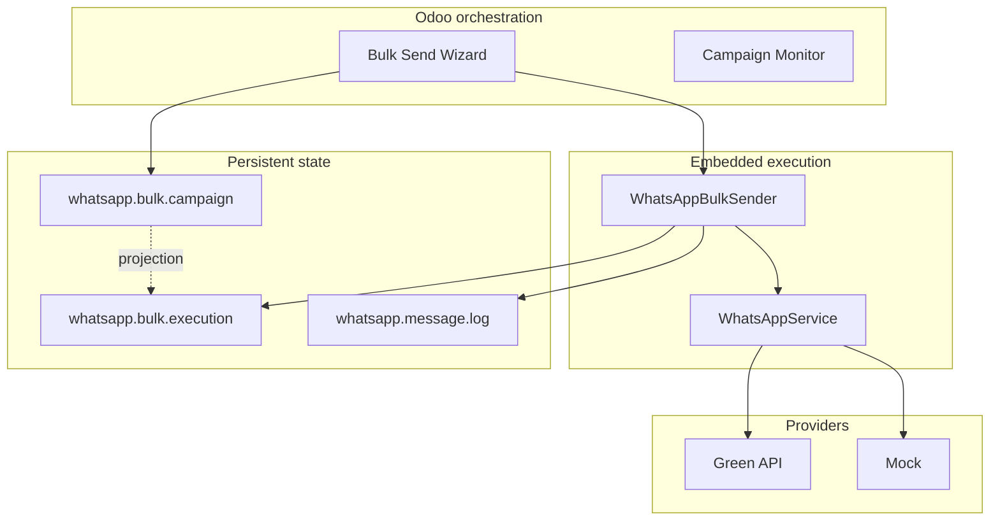

# RelayRuntime — Documentation

Technical documentation for **RelayRuntime** — a replay-safe operational messaging execution runtime initially delivered as Odoo module `relayruntime` under `apps/odoo/relayruntime/` (version **19.0.6.1.0**).

This documentation describes **what is implemented today**, including known gaps. Planned designs are labeled explicitly and are not presented as completed features.

## Documentation map

| Section | Purpose |
|---------|---------|
| [Reconstruction](reconstruction/IMPLEMENTATION_CONTRACT.md) | MERGE-003 contract, ownership, baselines |
| [Architecture](architecture/runtime-boundaries.md) | Boundaries, lifecycle, vision, extraction, data model, transactions |
| [Recovery](recovery/replay-recovery.md) | Replay philosophy, retry lineage, stale reconciliation |
| [Runtime](runtime/EXECUTION_FLOW.md) | Step-by-step execution, leases, outbound intents |
| [Deployment](deployment/embedded-runtime.md) | Embedded topology, evolution, install, production |
| [Infrastructure](infrastructure/GITHUB_PAGES_PIPELINE.md) | GitHub Pages product website pipeline (RWPST standard) |
| [Operations](operations/operational-guidelines.md) | Guidelines, observability, failures, runbook |
| [Testing](testing/TESTING_STRATEGY.md) | Verification strategy and failure simulations |
| [Releases](releases/VERSIONING.md) | Versioning and release process |
| [Development](development/CODEBASE_STRUCTURE.md) | Code layout and runtime safety rules |

## Quick links

### Architecture (foundation)

- [Runtime boundaries](architecture/runtime-boundaries.md)
- [Execution lifecycle](architecture/execution-lifecycle.md)
- [Runtime vision](architecture/runtime-vision.md)
- [Future extraction strategy](architecture/future-extraction-strategy.md)
- [System overview](architecture/SYSTEM_OVERVIEW.md)
- [Data model](architecture/DATA_MODEL.md)
- [Transaction model](architecture/TRANSACTION_MODEL.md)
- [Execution runtime](architecture/EXECUTION_RUNTIME.md)
- [Known limitations](architecture/KNOWN_LIMITATIONS.md)
- [Provider adapters](PROVIDER_ARCHITECTURE.md)

### Recovery

- [Replay and recovery](recovery/replay-recovery.md)
- [Retry lineage](recovery/retry-lineage.md)
- [Stale execution reconciliation](recovery/stale-execution-reconciliation.md)

### Runtime (implementation detail)

- [Execution flow](runtime/EXECUTION_FLOW.md)
- [Retry and replay](runtime/RETRY_AND_REPLAY.md)
- [Heartbeat and leases](runtime/HEARTBEAT_AND_LEASES.md)
- [Outbound intents](runtime/OUTBOUND_INTENTS.md)

### Deployment

- [Embedded runtime (current)](deployment/embedded-runtime.md)
- [Deployment evolution](deployment/deployment-evolution.md)
- [Future runtime service](deployment/future-runtime-service.md)
- [Local setup](deployment/LOCAL_SETUP.md)
- [Odoo.sh deployment](deployment/ODOO_SH_DEPLOYMENT.md)
- [Environment variables](deployment/ENVIRONMENT_VARIABLES.md)
- [Production checklist](deployment/PRODUCTION_CHECKLIST.md)

### Infrastructure

- [GitHub Pages pipeline](infrastructure/GITHUB_PAGES_PIPELINE.md) — publish `landing-page/` / `site/` via Actions (custom domain, DNS, reuse)

### Operations

- [Operational guidelines](operations/operational-guidelines.md)
- [Observability](operations/observability.md)
- [Failure scenarios](operations/failure-scenarios.md)
- [Runbook](operations/RUNBOOK.md)
- [Troubleshooting](operations/TROUBLESHOOTING.md)
- [Monitoring guide](operations/MONITORING_GUIDE.md)

### Testing

- [Testing strategy](testing/TESTING_STRATEGY.md)
- [Runtime failure tests](testing/RUNTIME_FAILURE_TESTS.md)
- [Concurrency tests](testing/CONCURRENCY_TESTS.md)
- [Large campaign tests](testing/LARGE_CAMPAIGN_TESTS.md)

### Development & releases

- [Contributing (repo root)](../CONTRIBUTING.md)
- [Contributing (docs)](development/CONTRIBUTING.md)
- [Codebase structure](development/CODEBASE_STRUCTURE.md)
- [ORM guidelines](development/ORM_GUIDELINES.md)
- [Runtime safety rules](development/RUNTIME_SAFETY_RULES.md)
- [Versioning](releases/VERSIONING.md)
- [Release process](releases/RELEASE_PROCESS.md)

## Root documentation

| File | Role |
|------|------|
| [README.md](../README.md) | Project overview, install, roadmap |
| [MIGRATION.md](../MIGRATION.md) | `whatsapp_simple` → `relayruntime` |
| [CONTRIBUTING.md](../CONTRIBUTING.md) | Runtime engineering contribution |
| [SECURITY.md](../SECURITY.md) | Security and operational integrity |
| [SUPPORT.md](../SUPPORT.md) | Issue reporting and operational support |
| [BRD_WhatsApp_Integration.md](../BRD_WhatsApp_Integration.md) | Product + runtime architecture specification |
| [CHANGELOG.md](../CHANGELOG.md) | Version history |

## Implementation status legend

| Label | Meaning |
|-------|---------|
| **Implemented** | Present in code and used at runtime |
| **Partially implemented** | Present but incomplete, best-effort, or with known gaps |
| **Planned / future** | Direction only; not in production code paths |

## Module at a glance

## Legacy

- [ARCHITECTURE.md](ARCHITECTURE.md) — superseded by `architecture/`; retained for old links
- [future-runtime-extraction.md](deployment/future-runtime-extraction.md) — redirects to [future-extraction-strategy.md](architecture/future-extraction-strategy.md)
