# WhatsApp Simple — Documentation

Technical documentation for the **WhatsApp Simple** Odoo 19 Community module (`whatsapp_simple`, version **19.0.5.5.0**).

This documentation describes **what is implemented today**, including known gaps. It does not present planned designs as completed features.

## Documentation map

| Section | Purpose |
|---------|---------|
| [Architecture](architecture/SYSTEM_OVERVIEW.md) | System design, data model, transactions, execution runtime, limitations |
| [Runtime](runtime/EXECUTION_FLOW.md) | Step-by-step execution, retry/replay, leases, outbound intents |
| [Deployment](deployment/LOCAL_SETUP.md) | Install, configure, production constraints |
| [Testing](testing/TESTING_STRATEGY.md) | Verification strategy and failure simulations |
| [Operations](operations/RUNBOOK.md) | Recovery procedures for stuck runs |
| [Releases](releases/VERSIONING.md) | Versioning and release process |
| [Development](development/CODEBASE_STRUCTURE.md) | Contributor guide and safety rules |

## Quick links

### Architecture

- [System Overview](architecture/SYSTEM_OVERVIEW.md)
- [Data Model](architecture/DATA_MODEL.md)
- [Transaction Model](architecture/TRANSACTION_MODEL.md)
- [Execution Runtime](architecture/EXECUTION_RUNTIME.md)
- [Known Limitations](architecture/KNOWN_LIMITATIONS.md)
- [Provider Adapters](PROVIDER_ARCHITECTURE.md) *(legacy doc; adapter detail still valid)*

### Runtime

- [Execution Flow](runtime/EXECUTION_FLOW.md)
- [Retry and Replay](runtime/RETRY_AND_REPLAY.md)
- [Heartbeat and Leases](runtime/HEARTBEAT_AND_LEASES.md)
- [Outbound Intents](runtime/OUTBOUND_INTENTS.md)

### Deployment

- [Local Setup](deployment/LOCAL_SETUP.md)
- [Odoo.sh Deployment](deployment/ODOO_SH_DEPLOYMENT.md)
- [Environment Variables](deployment/ENVIRONMENT_VARIABLES.md)
- [Production Checklist](deployment/PRODUCTION_CHECKLIST.md)

### Testing

- [Testing Strategy](testing/TESTING_STRATEGY.md)
- [Runtime Failure Tests](testing/RUNTIME_FAILURE_TESTS.md)
- [Concurrency Tests](testing/CONCURRENCY_TESTS.md)
- [Large Campaign Tests](testing/LARGE_CAMPAIGN_TESTS.md)

### Operations

- [Runbook](operations/RUNBOOK.md)
- [Troubleshooting](operations/TROUBLESHOOTING.md)
- [Monitoring Guide](operations/MONITORING_GUIDE.md)

### Development

- [Contributing](development/CONTRIBUTING.md)
- [Codebase Structure](development/CODEBASE_STRUCTURE.md)
- [ORM Guidelines](development/ORM_GUIDELINES.md)
- [Runtime Safety Rules](development/RUNTIME_SAFETY_RULES.md)

## Implementation status legend

Throughout this documentation:

| Label | Meaning |
|-------|---------|
| **Implemented** | Present in code and used at runtime |
| **Partially implemented** | Present but incomplete, best-effort, or with known gaps |
| **Planned / future** | Described for direction only; not in production code paths |

## Module at a glance

```mermaid
flowchart TB
    subgraph UI["Odoo UI"]
        WZ[Bulk Send Wizard]
        SW[Single Send Wizard]
        MON[Campaign Monitor]
    end
    subgraph Models["Persistent models"]
        CFG[whatsapp.config]
        CAMP[whatsapp.bulk.campaign]
        EXEC[whatsapp.bulk.execution]
        LOG[whatsapp.message.log]
    end
    subgraph Services["Services"]
        BULK[WhatsAppBulkSender]
        SAFE[WhatsAppSafetyValidator]
        FACADE[WhatsAppService]
    end
    subgraph Providers["Providers"]
        GREEN[Green API - Implemented]
        MOCK[Mock - Implemented]
        STUB[Stubs - Not implemented]
    end
    WZ --> CAMP
    WZ --> BULK
    BULK --> EXEC
    BULK --> LOG
    BULK --> FACADE
    FACADE --> GREEN
    FACADE --> MOCK
    FACADE --> STUB
    CAMP -. projection .-> EXEC
```

## Related files outside `/docs`

| File | Role |
|------|------|
| [`../BRD_WhatsApp_Integration.md`](../BRD_WhatsApp_Integration.md) | **Product + runtime architecture specification** (authoritative BRD) |
| [`../README.md`](../README.md) | Module install and user-facing overview |
| [`../CHANGELOG.md`](../CHANGELOG.md) | Version history |
| [`ARCHITECTURE.md`](ARCHITECTURE.md) | Legacy overview *(superseded by `architecture/`; kept for links)* |
