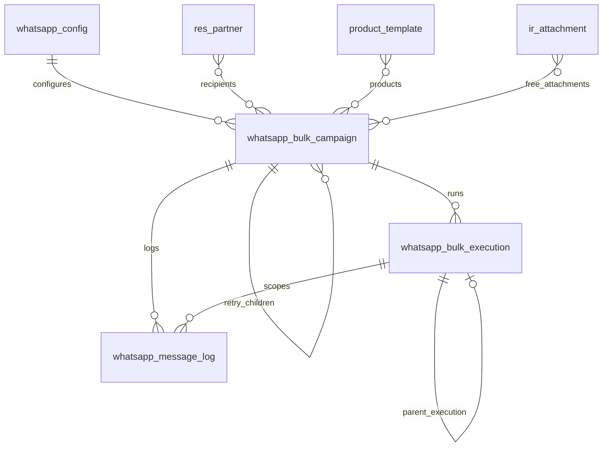
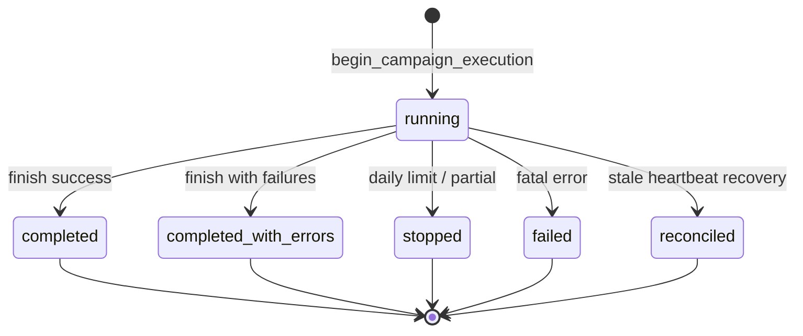

# Data Model

[← Documentation index](../README.md) · [System Overview](SYSTEM_OVERVIEW.md)

## Persistent models

| Model | Technical name | Purpose |
|-------|----------------|---------|
| WhatsApp Configuration | `whatsapp.config` | Provider credentials, safety limits, logging options |
| Bulk Campaign | `whatsapp.bulk.campaign` | Campaign definition, aggregate stats, UI progress |
| Bulk Execution | `whatsapp.bulk.execution` | Per-run runtime authority (lease, heartbeat, outcome) |
| Message Log | `whatsapp.message.log` | Per-recipient delivery record |
| Sale Order extension | `sale.order` | Optional `whatsapp_campaign_id` link |
| Partner extension | `res.partner` | Phone normalization helpers |

## Transient models

| Model | Technical name | Purpose |
|-------|----------------|---------|
| Bulk Send Wizard | `whatsapp.bulk.send.wizard` | Bulk compose and launch |
| Single Send Wizard | `whatsapp.send.wizard` | One-off send |
| Product Selection Wizard | `whatsapp.product.selection.wizard` | Manual SO line selection |
| Delivery Dashboard | `whatsapp.delivery.dashboard` | Snapshot stats on open |

Transient records are not part of execution lineage.

## Entity relationships



## Execution lineage

Each bulk HTTP run creates exactly one `whatsapp.bulk.execution` row.

| Field | Semantics |
|-------|-----------|
| `execution_uuid` | Immutable identity; copied to campaign `execution_token` while running |
| `campaign_id` | Owning campaign |
| `parent_execution_id` | For `attempt_kind=retry`, points to latest execution on `parent_campaign_id` |
| `attempt_kind` | `initial` or `retry` |
| `retry_fingerprint` | Copied from campaign when present |
| `state` | `pending`, `running`, terminal states, or `reconciled` |

Execution states:



## Retry lineage

Separate from execution lineage at the **campaign** level:

| Field | Model | Constraint |
|-------|-------|------------|
| `parent_campaign_id` | `whatsapp.bulk.campaign` | Links retry child to parent |
| `retry_fingerprint` | `whatsapp.bulk.campaign` | Unique per `(parent_campaign_id, retry_fingerprint)` |

Fingerprint payload (SHA-1 input):

```
parent_id | message | sorted(attachment_ids) | sorted(product_ids) | sorted(partner_ids)
```

Changing message, attachments, products, or recipient set produces a **new** fingerprint and allows a **new** retry campaign.

## Campaign state fields

| Field group | Examples | Updated by |
|-------------|----------|------------|
| Lifecycle | `state`, `started_at`, `finished_at` | Execution projection / reconciliation |
| Live UI | `current_recipient_id`, `current_step`, `progress_percent` | Execution progress (throttled on attachment sub-steps) |
| Counters | `sent_count`, `failed_count`, `skipped_count` | In-memory stats at finish (not log-derived) |
| Legacy mirror | `processing_state`, `total_success` | Computed / related fields |

## Message log state fields

| Field | Notes |
|-------|-------|
| `delivery_state` | `queued`, `sending`, `sent`, `delivered`, `failed`, `skipped` |
| `status` | Legacy computed from `delivery_state` |
| `idempotency_key` | Unique when set; campaign-scoped dedupe |
| `execution_id` | Links log to execution attempt |
| `outbound_intent_at` | Set when intent flushed before provider call |
| `api_message_id` | From provider response when available |

**Partially implemented:** `delivered` state exists but outbound flow typically stops at `sent`.

## Ownership semantics

| Resource | Owner | ACL notes |
|----------|-------|-----------|
| Config | Company | Manager write; User read |
| Campaign | Creating user (`user_id`) | User create/write; no per-user record rules |
| Execution | Executor (`executor_uid`) | User create/read; Manager full |
| Logs | Company | User create only (no write); Manager full |
| Attachments on campaign | Global `ir.attachment` | M2M uses `bypass_search_access=True` |

Same-company users can see and retry other users' campaigns (no owner-based `ir.rule`).

## Authority vs projection

| Question | Authoritative source | Projection |
|----------|---------------------|------------|
| Is a run active? | `whatsapp.bulk.execution` lease + state | Campaign `state=running`, `active_execution_id` |
| Is executor alive? | `execution.heartbeat_at` | Campaign `last_activity_at` (touch on heartbeat) |
| Did recipient X send? | `whatsapp.message.log` + idempotency key | Campaign counters at end |
| Can I start another run? | Lease gate on execution | Campaign must not have valid competing lease |

**Planned / future:** derive campaign counters from logs; per-recipient attempt table; event log.

## SQL constraints (implemented)

| Constraint | Table | Columns |
|------------|-------|---------|
| `whatsapp_retry_fingerprint_unique` | `whatsapp_bulk_campaign` | `parent_campaign_id`, `retry_fingerprint` |
| `whatsapp_message_log_idempotency_key_unique` | `whatsapp_message_log` | `idempotency_key` |
| `whatsapp_bulk_execution_uuid_unique` | `whatsapp_bulk_execution` | `execution_uuid` |

## Further reading

- [Transaction Model](TRANSACTION_MODEL.md)
- [Execution Runtime](EXECUTION_RUNTIME.md)
- [Retry and Replay](../runtime/RETRY_AND_REPLAY.md)
