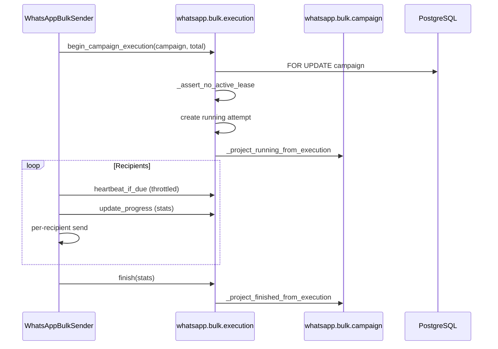

# Execution Runtime

[← Documentation index](../README.md) · [System Overview](SYSTEM_OVERVIEW.md)

## Overview

Bulk sending is orchestrated by `WhatsAppBulkSender` (`services/whatsapp_bulk_service.py`) under control of `whatsapp.bulk.execution`.

Constants (`constants.py`):

| Constant | Value | Purpose |
|----------|-------|---------|
| `EXECUTION_LEASE_MINUTES` | 15 | Lease extension interval |
| `EXECUTION_STALE_MINUTES` | 30 | Stale detection threshold |
| `EXECUTION_HEARTBEAT_EVERY_N_RECIPIENTS` | 5 | Recipient-index heartbeat trigger |
| `EXECUTION_HEARTBEAT_MIN_INTERVAL_SECONDS` | 45 | Time-based heartbeat fallback |

## Execution-attempt flow

Entry points that reconcile stale runs first:

- `whatsapp.bulk.send.wizard.action_send`
- `whatsapp.bulk.campaign.action_retry_failed_recipients`

## Lease acquisition and release

### Acquisition (`begin_campaign_execution`)

1. `_reconcile_stale_executions()`
2. `campaign._lock_for_execution()` — `SELECT id FROM whatsapp_bulk_campaign WHERE id = %s FOR UPDATE`
3. `_assert_no_active_lease(campaign)` — reject if another `state=running` attempt has `lease_expires_at > now`
4. Create attempt with new `execution_uuid` and `lease_token`
5. Project campaign to `running`

### Extension (heartbeat)

On heartbeat: update `heartbeat_at` and extend `lease_expires_at` by 15 minutes.

### Release (`finish` or reconcile)

Clear `lease_token` and `lease_expires_at`; set terminal `state` and `finished_at`.

## Heartbeat lifecycle

**Implemented** in `heartbeat_if_due(recipient_index, force=False)`:

| Trigger | Action |
|---------|--------|
| `recipient_index == 0` | Force heartbeat |
| Every 5th recipient index | Eligible |
| ≥45s since `heartbeat_at` | Eligible even off 5th index |
| Otherwise | No write |

Heartbeat updates:

- Execution: `heartbeat_at`, `lease_expires_at`, `last_recipient_index`
- Campaign: `_touch_execution_liveness` (lightweight: `last_activity_at`, lease fields)

**Not implemented:** separate heartbeat worker or cron.

## Zombie reconciliation

`_reconcile_stale_executions(stale_minutes=30)`:

**Selects** running attempts where:

- `heartbeat_at <= cutoff`, or
- `heartbeat_at` is false and `started_at <= cutoff`

**Action:**

- Set execution `state = reconciled`
- Clear lease fields
- If campaign's `active_execution_id` matches, project campaign to `failed` with reconciled progress

Campaign-level `_reconcile_stale_running_campaigns` remains as **fallback** for campaigns stuck `running` without a live lease.

## Retry execution flow

1. Parent campaign must not have an active valid lease (or appears stale after reconcile).
2. Build recipient set from failed/skipped logs.
3. Dedup retry campaign by fingerprint.
4. `WhatsAppBulkSender` on retry campaign calls `begin_campaign_execution` with `attempt_kind=retry`.
5. `parent_execution_id` = latest execution on parent campaign.

Each retry campaign run is a **new** execution row; parent execution is not resumed.

## Campaign projection updates

| Method | When | Campaign fields |
|--------|------|-------------------|
| `_project_running_from_execution` | Start | `state=running`, counters zeroed, `active_execution_id` |
| `_project_progress_from_execution` | Progress (non-throttled) | Progress %, current recipient, counters from execution |
| `_touch_execution_liveness` | Heartbeat only | `last_activity_at`, lease mirror |
| `_project_finished_from_execution` | End | `_mark_finished` + clear `active_execution_id` |
| `_project_reconciled_from_execution` | Stale reconcile | `state=failed`, terminal timestamps |

**Throttling:** attachment and product image sub-steps pass `throttle=True` to skip full campaign progress writes; execution counters still update on recipient completion.

## Further reading

- [Execution Flow](../runtime/EXECUTION_FLOW.md)
- [Heartbeat and Leases](../runtime/HEARTBEAT_AND_LEASES.md)
- [Data Model](DATA_MODEL.md)
