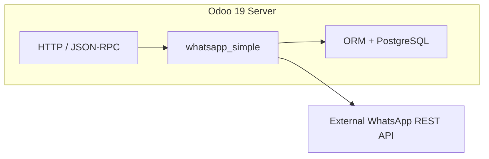
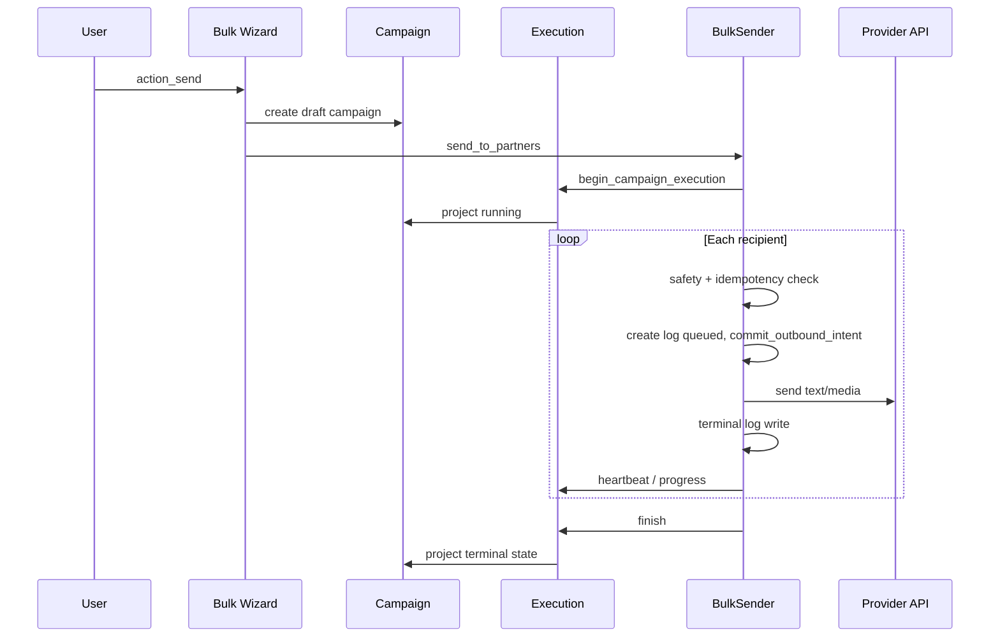

# System Overview

[← Documentation index](../README.md)

## Purpose

**WhatsApp Simple** is an Odoo 19 Community application module that sends WhatsApp messages from the backend using a **provider adapter** pattern. Primary use cases:

- Single-message send from contacts or sales orders
- Bulk campaigns with attachments and product catalogs
- Delivery logging and campaign monitoring
- Manual sale order creation from customer product selections

**Runtime model:** synchronous, in-process execution inside the Odoo HTTP worker handling the user request. There is **no** background job queue or module-owned cron worker for bulk sending.

## Platform architecture

| Layer | Location | Responsibility |
|-------|----------|----------------|
| UI | `views/`, `wizard/` | Forms, wizards, campaign monitor kanban |
| Models | `models/` | Persistence, ACL, campaign/execution/log lifecycle |
| Services | `services/` | Bulk orchestration, safety, product catalog, provider facade |
| Providers | `services/providers/` | Vendor-specific HTTP adapters |
| Webhook skeleton | `services/webhook/` | **Planned** routing only; no HTTP controllers |

See also [Provider Architecture](../PROVIDER_ARCHITECTURE.md) for adapter contracts.

## Odoo integration model

**Implemented**

- Standard Odoo module (`__manifest__.py`, security groups, `ir.model.access.csv`)
- Depends on `base`, `sale`, `mail`, `product`
- Extends `res.partner` (phone helpers) and `sale.order` (campaign link)
- Multi-company record rules on config, campaigns, and logs
- Transient wizards for send flows and delivery dashboard snapshot

**Not implemented**

- Dedicated `ir.cron` jobs for campaign processing
- Mail thread integration for inbound WhatsApp replies
- Public webhook controllers

## Execution runtime model

Bulk sends run in **one HTTP request** until completion, stop, or fatal error.

| Concept | Authority | Role |
|---------|-----------|------|
| `whatsapp.bulk.execution` | **Runtime authority** | One row per actual run; lease, heartbeat, counters during execution |
| `whatsapp.bulk.campaign` | **Aggregate / projection** | Business record, UI monitor, historical summary |
| `whatsapp.message.log` | **Per-recipient truth** | Delivery state per partner attempt within a campaign |

Details: [Execution Runtime](EXECUTION_RUNTIME.md), [Execution Flow](../runtime/EXECUTION_FLOW.md).

## Campaign lifecycle

**Implemented** campaign states (`whatsapp.bulk.campaign.state`):

| State | Meaning |
|-------|---------|
| `draft` | Created; not yet executing |
| `running` | Active bulk send (mirrors active execution) |
| `completed` | All recipients processed, no failures |
| `completed_with_errors` | Finished with at least one failed recipient |
| `stopped` | Stopped early (e.g. daily limit); unprocessed recipients remain |
| `failed` | Fatal error or stale reconciliation |

Legacy `processing_state` is computed for older views (`done` / `cancelled` mapping).

Terminal progress is derived from `sent + failed + skipped` vs `total_count` (not forced to 100% on partial stop).

## Retry lineage

**Implemented**

1. User triggers **Retry Failed Recipients** on a finished campaign.
2. Module builds `retry_fingerprint` (SHA-1 over parent id, message, attachment ids, product ids, partner ids).
3. If a child campaign with same `(parent_campaign_id, retry_fingerprint)` exists, UI opens that campaign instead of creating a duplicate.
4. New retry campaign gets `parent_campaign_id` set.
5. Bulk send creates a new **execution attempt** with `attempt_kind=retry` and `parent_execution_id` pointing to the latest execution on the parent campaign.

Retry campaigns are **separate** `whatsapp.bulk.campaign` records; parent logs are not modified.

## Execution-attempt architecture

**Implemented** in `whatsapp.bulk.execution` (since 19.0.5.5.0):

- Immutable `execution_uuid` per run
- Lease (`lease_token`, `lease_expires_at`) and executor (`executor_uid`)
- Heartbeat (`heartbeat_at`) refreshed during recipient loop
- Terminal states including `reconciled` for stale recovery
- Counters mirrored to campaign on finish

**Partially implemented**

- Counters during run are updated in memory on the sender and written to execution/campaign; they are **not** recomputed from logs after finish.

## Lease and heartbeat model

**Implemented** — see [Heartbeat and Leases](../runtime/HEARTBEAT_AND_LEASES.md).

- Lease duration: 15 minutes (`EXECUTION_LEASE_MINUTES`)
- Stale threshold: 30 minutes (`EXECUTION_STALE_MINUTES`)
- Heartbeat: every 5 recipients or ≥45s since last heartbeat

Before starting execution: `FOR UPDATE` lock on campaign row + reject if another running attempt has a valid lease.

## Attachment lifecycle

**Implemented**

| Source | Storage | Notes |
|--------|---------|-------|
| Wizard uploads | `ir.attachment` M2M on campaign | `bypass_search_access=True` on wizard/campaign M2M |
| Product images | `ir.attachment` created/reused via `WhatsAppProductService` | Reuse when same name, `res_model`, `res_id`, mimetype, and `datas` match |
| Product binding | `res_model='whatsapp.bulk.campaign'`, `res_id=campaign.id` | Set in bulk `prepare_send_plan` |

**Partially implemented**

- No dedicated attachment ownership table; attachments may outlive campaigns
- Cross-campaign reuse possible if binary identity matches under different `res_model`/`res_id`

## Persistence boundaries

| Boundary | Behavior |
|----------|----------|
| HTTP request | Default Odoo transaction: commit on success, rollback on unhandled exception |
| Mid-loop `cr.commit()` | **Removed** from bulk path (intentionally) |
| ORM `flush()` | Used before provider I/O via `commit_outbound_intent()` |
| Provider API | **Outside** database; irreversible once accepted |

See [Transaction Model](TRANSACTION_MODEL.md).

## Feature implementation matrix

| Capability | Status |
|------------|--------|
| Single send wizard | Implemented |
| Bulk send wizard | Implemented |
| Green API provider | Implemented |
| Mock provider | Implemented |
| Meta / Evolution / UltraMsg / Twilio / Gupshup / Custom | Stub only (`is_implemented=False`) |
| Execution attempts + lease | Implemented |
| Recipient idempotency (campaign scope) | Implemented |
| Retry fingerprint deduplication | Implemented |
| Stale execution reconciliation | Implemented |
| Campaign monitor (5s kanban reload) | Implemented |
| Webhook inbound HTTP | Planned (skeleton only) |
| Async queue / cron bulk worker | Planned |
| Event-sourced counters | Planned |
| Provider-level outbound idempotency tokens | Planned |

## Further reading

- [Data Model](DATA_MODEL.md)
- [Known Limitations](KNOWN_LIMITATIONS.md)
- [Runtime Safety Rules](../development/RUNTIME_SAFETY_RULES.md)
