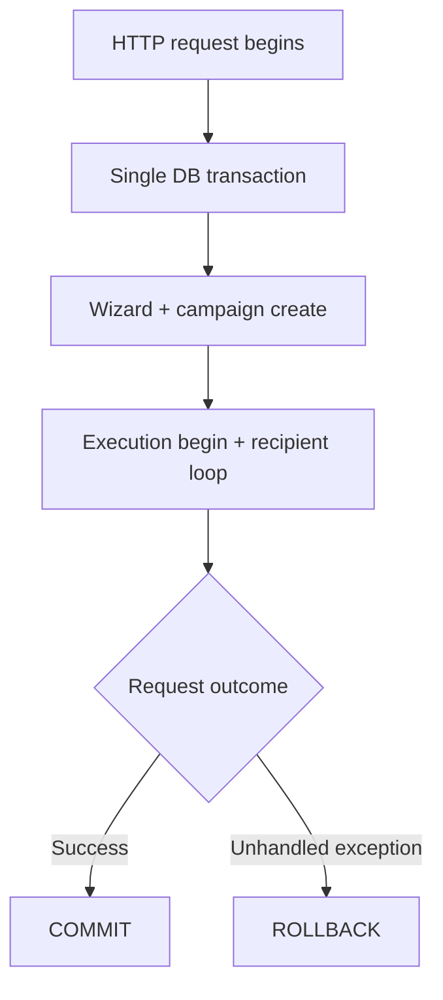

# Transaction Model

[← Documentation index](../README.md) · [System Overview](SYSTEM_OVERVIEW.md)

## Transaction boundaries

### Default Odoo HTTP transaction

**Implemented:** All wizard and bulk-sender work for one user action runs in a **single database transaction** that commits when the HTTP request completes successfully.



### Removed mid-loop commits

**Implemented (since stabilization):**

- `WhatsAppBulkSender._commit_progress()` is a no-op
- Bulk wizard does **not** call `cr.commit()` before sending
- Progress updates call `flush()` only when explicitly needed

**Previously (removed):** explicit `cr.commit()` during the recipient loop created partial durable state on crash.

### ORM flush before provider I/O

**Implemented:** `whatsapp.message.log.commit_outbound_intent()`:

1. Sets `outbound_intent_at`
2. Promotes `queued` → `sending` if needed
3. Calls `flush_recordset()` on key fields

This makes intent visible within the **same** transaction before irreversible HTTP calls to the provider. It does **not** commit to disk independently.

## Provider-side consistency limitations

| Scenario | DB after request | Provider |
|----------|------------------|----------|
| Provider success, then unhandled exception | May **rollback** entire request | Message may already be sent |
| Provider success, sender catches and returns stats | **Commit** with terminal log | Message sent |
| Process kill mid-request | Transaction may never commit | Unknown partial sends |
| `ValidationError` daily limit mid-loop | Commit with `stopped` + partial logs | Partial sends possible |

**There is no two-phase commit** between PostgreSQL and WhatsApp APIs.

## Runtime durability semantics

| Artifact | Durable when |
|----------|--------------|
| Campaign / execution rows | Request commit |
| Message logs | Request commit |
| Outbound intent flush | Visible in open transaction only until commit |
| Provider delivery | Independent of Odoo commit |

**Partially implemented:** crash recovery relies on stale execution reconciliation, not on resuming an in-flight transaction.

## Idempotency model

**Implemented** at message log level:

```
idempotency_key = campaign:{campaign_id}:partner:{partner_id}
```

| Mechanism | Behavior |
|-----------|----------|
| Pre-send search | Skip recipient if key exists |
| `create_log` | Returns existing row if key found |
| SQL unique constraint | `IntegrityError` → fetch existing |

**Scope:** Same **campaign** only. Retry campaigns have new `campaign_id` and may resend the same partner.

**Not implemented:**

- Provider outbound idempotency keys
- Attempt-scoped idempotency keys (execution UUID is lineage only today)
- Cross-campaign business deduplication

## Rollback limitations

When the HTTP transaction rolls back after provider success:

- No message log row survives
- User may retry and provider may receive a duplicate message
- Mock/Green API do not deduplicate by Odoo idempotency key

Sender mitigates **re-raise after partial external success** by catching fatal errors, calling `execution.finish()`, and returning stats instead of propagating (reduces rollback amplification; does not eliminate provider duplicates).

## Known consistency tradeoffs

| Tradeoff | Rationale | Status |
|----------|-----------|--------|
| Single long transaction | Avoid partial DB state from mid-loop commits | Implemented |
| In-memory counters | Simplicity; fewer writes during loop | Partially implemented |
| Campaign projection lag | Throttled writes on attachment sub-steps | Implemented |
| Lease without distributed lock | `FOR UPDATE` + lease sufficient for single-worker dev | Partially implemented for multi-worker |
| Flush without commit before provider | Best-effort intent without architectural outbox | Implemented |

## Planned / future (not implemented)

- Savepoint-per-recipient with selective commit
- Transactional outbox table + async dispatcher
- Log-derived campaign counters at finish
- Provider idempotency header support

## Further reading

- [Outbound Intents](../runtime/OUTBOUND_INTENTS.md)
- [Known Limitations](KNOWN_LIMITATIONS.md)
- [Runtime Safety Rules](../development/RUNTIME_SAFETY_RULES.md)
