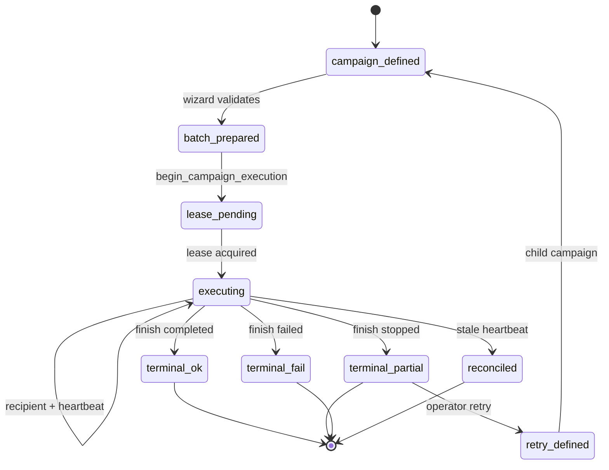
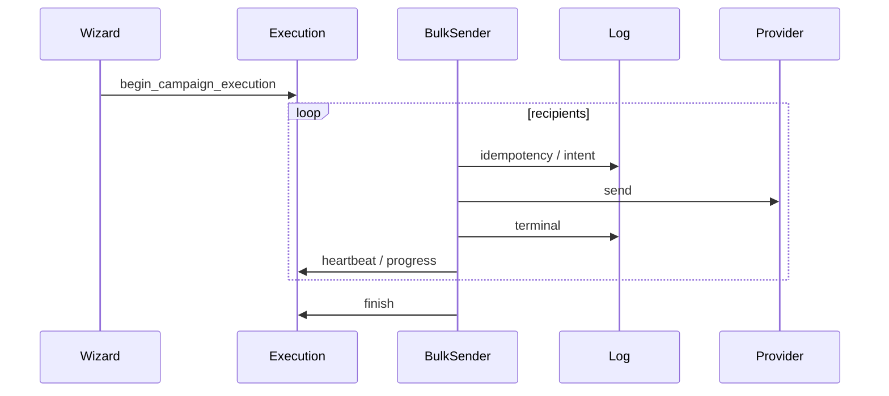

# Execution Lifecycle

[← Documentation index](../README.md) · [Runtime boundaries](runtime-boundaries.md)

End-to-end lifecycle for a **bulk operational messaging run** as implemented in RelayRuntime 19.0.6.x. Terminology applies to future extracted runtime unless noted.

---

## Lifecycle map

---

## 1. Campaign creation

| Step | Component | Status |
|------|-----------|--------|
| User composes payload | `whatsapp.bulk.send.wizard` | Implemented |
| Campaign row created | `whatsapp.bulk.campaign` `draft` | Implemented |
| Partners/products bound | M2M fields | Implemented |

Campaign is the **business container**—not yet executing.

---

## 2. Batching (preparation)

| Step | Component | Status |
|------|-----------|--------|
| Validate config / limits | `WhatsAppSafetyValidator` | Implemented |
| Sort partners, resolve phones | `_batch_prepare_partners` | Implemented |
| Product/attachment plan | `WhatsAppProductService` | Implemented |
| **Async queue enqueue** | — | **Not implemented** |

“Batch” today means **in-memory recipient list** in one HTTP request—not a persisted queue.

---

## 3. Lease acquisition

| Step | Component | Status |
|------|-----------|--------|
| Reconcile stale executions | `_reconcile_stale_executions` | Implemented |
| Lock campaign row | `FOR UPDATE` | Implemented |
| Reject if active lease | `_assert_no_active_lease` | Implemented |
| Create execution row | `whatsapp.bulk.execution` `running` | Implemented |
| Project campaign `running` | `_project_running_from_execution` | Implemented |

Constants: lease extension 15 min; stale 30 min without heartbeat ([`constants.py`](../../apps/odoo/relayruntime/constants.py)).

---

## 4. Execution (recipient loop)

| Step | Component | Status |
|------|-----------|--------|
| Inter-recipient delay | `time.sleep` safety | Implemented |
| Daily limit check | `check_daily_limit_mid_send` | Implemented |
| Idempotency lookup | `campaign:{id}:partner:{id}` | Implemented |
| Outbound intent | `queued` → `commit_outbound_intent` flush | Partial |
| Provider segments | text + attachments + product images | Implemented |
| Terminal log | `sent` / `failed` / `skipped` | Implemented |
| Heartbeat | every 5 recipients / 45s | Implemented |
| Progress projection | execution → campaign | Implemented |

---

## 5. Retry (separate lifecycle branch)

| Step | Component | Status |
|------|-----------|--------|
| Select failed/skipped logs | `action_retry_failed_recipients` | Implemented |
| Fingerprint dedup | SHA-1 + unique constraint | Implemented |
| Child campaign | `parent_campaign_id` | Implemented |
| New execution | `attempt_kind=retry` | Implemented |
| `parent_execution_id` | latest parent execution | Implemented |

Retry starts a **new** campaign + **new** execution—not resume of prior loop index.

Detail: [../recovery/retry-lineage.md](../recovery/retry-lineage.md)

---

## 6. Replay and reconcile

| Mechanism | Trigger | Outcome |
|-----------|---------|---------|
| Stale heartbeat | No heartbeat 30+ min | execution `reconciled`, campaign may `failed` |
| Idempotent skip | Existing log key | recipient `skipped` |
| Operator replay | Manual retry / new bulk | Business decision |

**Not implemented:** automatic resume from `last_recipient_index`.

Detail: [../recovery/replay-recovery.md](../recovery/replay-recovery.md)

---

## 7. Recovery

Operator-driven:

- Runbook procedures ([RUNBOOK](../operations/RUNBOOK.md))
- Shell reconcile (advanced)
- Provider dashboard for truth gaps

---

## 8. Completion

`execution.finish(stats)` sets terminal execution state and projects campaign:

| Condition | Execution / campaign terminal |
|-----------|--------------------------------|
| All processed, no failures | `completed` |
| Failures present | `completed_with_errors` |
| Daily limit / partial | `stopped` |
| Fatal exception path | `failed` |

Progress percent is **not** forced to 100% on partial stop.

---

## Sequence (implemented path)

---

## Related

- [EXECUTION_FLOW.md](../runtime/EXECUTION_FLOW.md) — step-by-step runtime doc
- [HEARTBEAT_AND_LEASES.md](../runtime/HEARTBEAT_AND_LEASES.md)
- [TRANSACTION_MODEL.md](TRANSACTION_MODEL.md)
