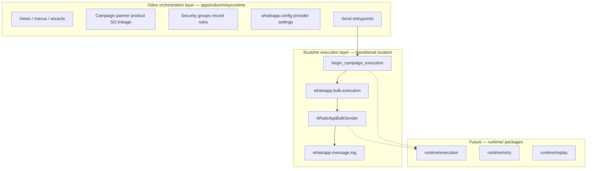

# Runtime Boundaries

[← Documentation index](../README.md)

RelayRuntime separates **orchestration** (ERP integration) from **execution** (messaging runtime). Today both live in the Odoo addon; repository layout prepares extraction.

---

## Boundary diagram

---

## Odoo orchestration layer

**Purpose:** Integrate messaging campaigns into Odoo business processes.

| Concern | Owner | Examples |
|---------|-------|----------|
| Business definition | Campaign model | Recipients, message, products, attachments |
| User interaction | Wizards, views | Bulk send, monitor kanban |
| Authorization | Security | WhatsApp User / Manager |
| ERP linkage | Extensions | `sale.order`, `res.partner` |
| Provider configuration | `whatsapp.config` | Tokens, limits, mock rates |

**Must not** become the long-term home for lease algorithms or provider loop logic.

---

## Runtime execution layer

**Purpose:** Own the lifecycle of a single bulk run—correctness under failure.

| Concern | Owner today | Authority |
|---------|-------------|-----------|
| Execution identity | `whatsapp.bulk.execution` | **Runtime authority** |
| Live ownership | Lease + heartbeat | Execution record |
| Send loop | `WhatsAppBulkSender` | Transitional service |
| Per-recipient outcome | `whatsapp.message.log` | Recipient truth |
| Campaign counters / UI progress | `whatsapp.bulk.campaign` | **Projection** |

### Authority rule

When orchestration and execution disagree, **execution attempt + logs** define what happened for that run. Campaign aggregates may lag mid-flight.

---

## Cross-boundary calls (today)

| Direction | Mechanism |
|-----------|-----------|
| Wizard → runtime | `WhatsAppBulkSender.send_to_partners()` |
| Runtime → orchestration | `_project_*_from_execution` on campaign |
| Runtime → provider | `WhatsAppService` → adapter |

All calls are **in-process** synchronous Python—no RPC.

---

## Extraction rules

1. `runtime/*` must not import Odoo when populated.
2. Odoo addon becomes adapter: persist/load DTOs, call runtime core.
3. Preserve `whatsapp.*` model `_name` until explicit migration program.
4. Idempotency and lease semantics are contract—version them.

Detail: [future-extraction-strategy.md](future-extraction-strategy.md)

---

## What is explicitly out of scope for orchestration layer

- Provider HTTP retry policies
- Heartbeat scheduling math
- Stale detection thresholds (constants may move to runtime config)
- Future queue consumer loops

---

## Related

- [Execution lifecycle](execution-lifecycle.md)
- [Runtime vision](runtime-vision.md)
- [Embedded runtime](../deployment/embedded-runtime.md)
