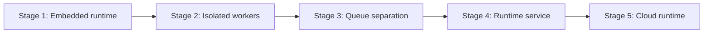

# Runtime Vision

[← Documentation index](../README.md)

Long-term direction for RelayRuntime: from **embedded Odoo execution** to **standalone operational messaging runtime** without claiming capabilities that do not exist today.

---

## Positioning

RelayRuntime is a **replay-safe operational messaging execution runtime**—initially delivered as an Odoo application. The runtime owns:

- execution identity and lineage
- lease-aware coordination
- recipient-level outcome records
- recovery-oriented reconciliation

Odoo remains the **orchestration and ERP integration** surface until extraction matures.

---

## Maturity stages

| Stage | Description | Status |
|-------|-------------|--------|
| **1 — Embedded** | Single-process Odoo HTTP worker runs bulk loop | **Current** |
| **2 — Isolated workers** | Dedicated Odoo cron/longpolling or subprocess workers | Planned |
| **3 — Queue separation** | Durable outbound queue; Odoo enqueues only | Planned |
| **4 — Runtime service** | HTTP/gRPC runtime API; Odoo as client | Planned |
| **5 — Cloud runtime** | Multi-tenant hosted execution plane | Aspirational |

Stages are **sequential capabilities**, not marketing tiers. Each stage must preserve replay and lineage semantics established in Stage 1.

---

## Design principles (stable across stages)

| Principle | Meaning |
|-----------|---------|
| Replay-safe | Re-running must not corrupt state; duplicates bounded by explicit rules |
| Lease-aware | At most one active owner per campaign execution scope |
| Lineage | Retries and replays trace parent campaign / execution |
| Observability | Operators can determine what ran, when, and outcome |
| Honest limits | No exactly-once claim without provider + ledger support |

---

## What changes per stage

| Concern | Stage 1 | Stage 4+ |
|---------|---------|----------|
| Process boundary | Odoo worker | Runtime service process |
| Transaction scope | Single PostgreSQL + HTTP | Split: queue ack vs provider |
| Stale detection | Heartbeat on execution row | Same semantics, different transport |
| Idempotency key | DB unique on log | Contract preserved in API |

---

## Non-goals (until explicitly built)

- Global distributed consensus
- Cross-region active-active without split-brain analysis
- Provider-agnostic exactly-once without idempotency tokens
- Event sourcing as system of record (may be evaluated later)

---

## Repository alignment

| Path | Role |
|------|------|
| `apps/odoo/relayruntime/` | Orchestration + embedded runtime today |
| `runtime/execution`, `runtime/retry`, `runtime/replay` | Extraction targets (placeholders) |
| `docs/deployment/` | Deployment maturity per stage |

---

## Related

- [future-extraction-strategy.md](future-extraction-strategy.md)
- [deployment-evolution.md](../deployment/deployment-evolution.md)
- [future-runtime-service.md](../deployment/future-runtime-service.md)
