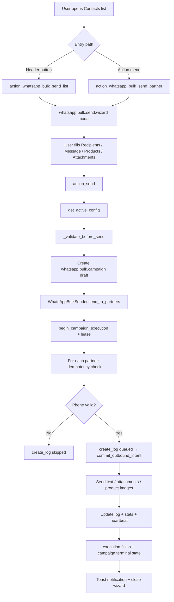
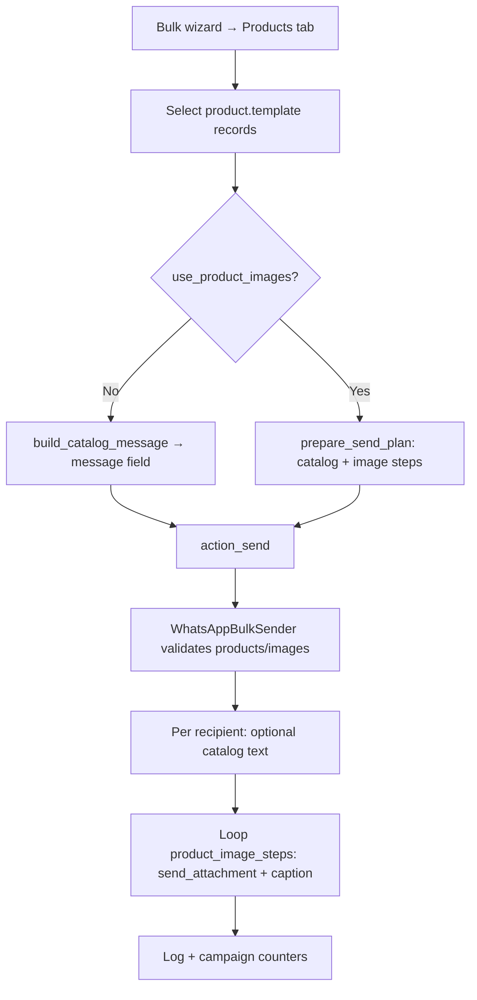
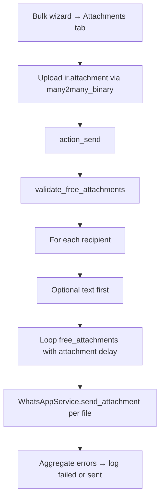
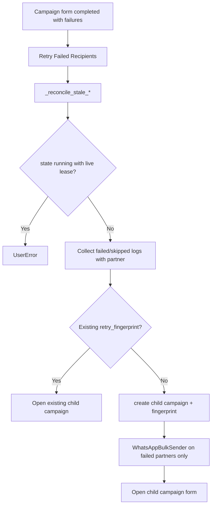
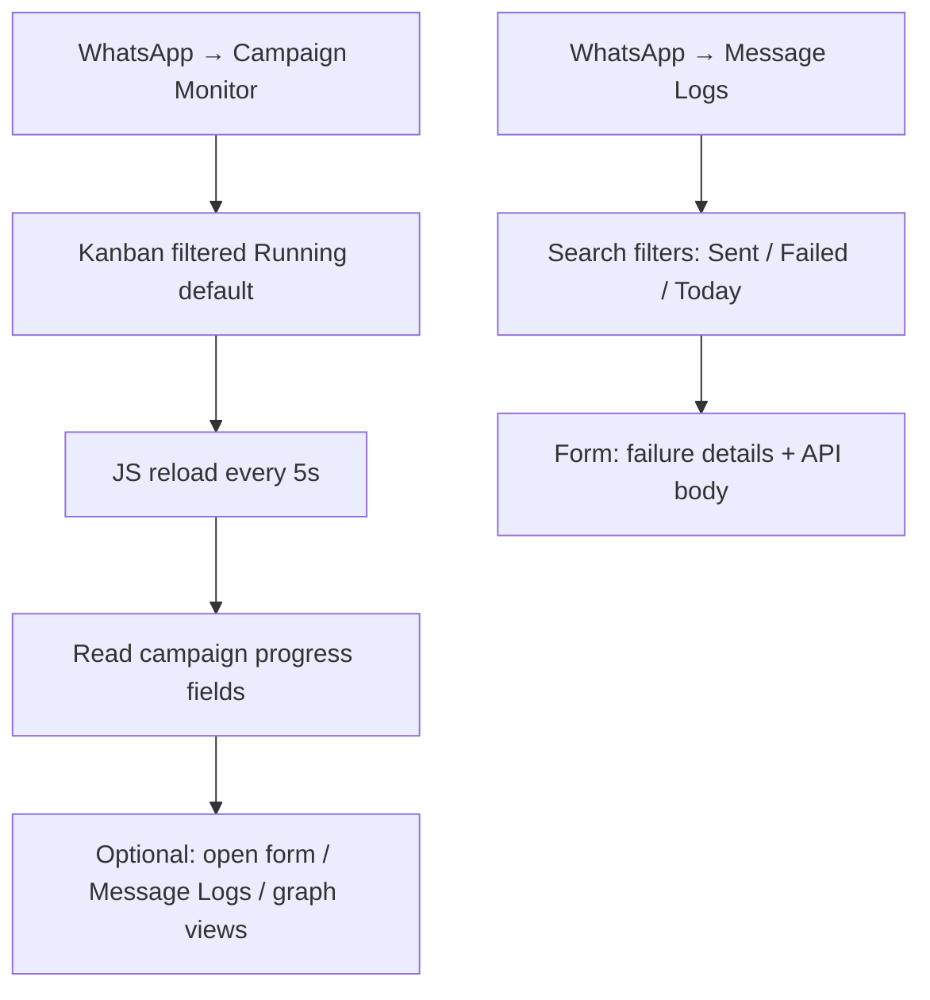
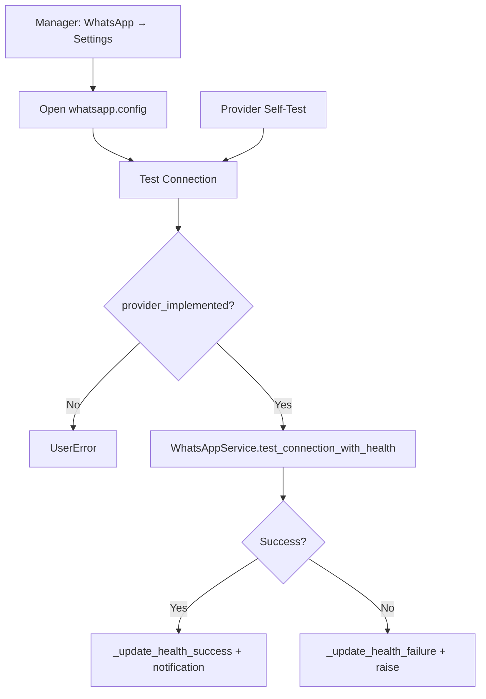

# RelayRuntime Feature & Workflow Discovery Audit

| Field | Value |
|-------|-------|
| Module | `relayruntime` (Odoo addon, technical name) |
| Version audited | `19.0.6.0.0` |
| Audit date | 2026-06-01 |
| Method | Static codebase analysis only (no runtime execution, no code changes) |
| Scope path | `whatsapp_simple/relayruntime/` |

---

## 1. Executive Summary

RelayRuntime is an Odoo 19 **application** (`application: True`) that orchestrates WhatsApp outbound campaigns from ERP data (contacts, products, sale orders). **Sending is real and synchronous** in the HTTP worker via `WhatsAppBulkSender` and `WhatsAppService`, but most in-app surfaces are **read-only archives** (`create="false"`, `edit="false"`) fed by wizards opened from **Contacts** or **Sales Orders**, not from the WhatsApp app root menu.

**Critical deployment gap:** `views/whatsapp_delivery_dashboard_views.xml` (menu + server action) exists in the repository but is **not listed in `__manifest__.py` `data`**, so the Delivery Dashboard is **dead on a standard install** unless loaded manually.

**No scheduled actions (`ir.cron`)** exist. Stale execution reconciliation runs only when invoked from bulk send, retry, or `begin_campaign_execution`.

**Production providers:** `green_api`, `mock_provider` only (`is_implemented = True`). All other provider types in the selection are UI-visible stubs.

---

## 2. Module Surface Inventory

### 2.1 Persistent models

| Model | Purpose | UI menu | Typical access |
|-------|---------|---------|----------------|
| `whatsapp.config` | Provider credentials, safety limits, health | WhatsApp → Settings (Manager) | Manager write; User read-only |
| `whatsapp.message.log` | Per-message delivery audit | WhatsApp → Message Logs | User read + create (runtime); no edit in views |
| `whatsapp.bulk.campaign` | Campaign aggregate + progress mirror | Bulk Campaigns, Campaign Monitor | User read/write create; unlink Manager only |
| `whatsapp.bulk.execution` | Lease/heartbeat execution attempts | Campaign form → Executions tab only | User read + create; no dedicated menu |
| `res.partner` (inherit) | Phone resolution, send entrypoints | Contacts app | Standard partner ACL + `group_whatsapp_user` on buttons |
| `sale.order` (inherit) | Campaign/log linkage fields | Sales app header button | Fields exist; **not on SO form view** |

### 2.2 Transient models (wizards)

| Model | Purpose |
|-------|---------|
| `whatsapp.send.wizard` | Single recipient send |
| `whatsapp.bulk.send.wizard` | Multi-recipient campaign composer |
| `whatsapp.product.selection.wizard` | Convert catalog outreach to `sale.order` |
| `whatsapp.product.selection.line` | Wizard lines |
| `whatsapp.delivery.dashboard` | Aggregated stats snapshot (transient) |

### 2.3 Services (non-ORM, invoked from models)

| Service | Role |
|---------|------|
| `WhatsAppService` | Provider facade: text, media, connection test |
| `WhatsAppBulkSender` | Sequential bulk loop, idempotency, progress projection |
| `WhatsAppProductService` | Catalog text, product image attachments |
| `WhatsAppSafetyValidator` | Delays, cooldowns, daily limit, attachment rules |
| `ProviderRegistry` | Provider factory |
| `WhatsAppWebhookRouter` | Skeleton only; no HTTP controller |
| Provider adapters | `green_api`, `mock_provider` implemented; others stub |

### 2.4 Security groups

| Group XML ID | Name | Default members | Implied |
|--------------|------|-----------------|--------|
| `relayruntime.group_whatsapp_user` | User | None (manual assignment) | — |
| `relayruntime.group_whatsapp_manager` | Manager | `base.user_root`, `base.user_admin` | User |

### 2.5 Record rules (multi-company)

Applied to: `whatsapp.message.log`, `whatsapp.config`, `whatsapp.bulk.campaign`.  
**Not applied to:** `whatsapp.bulk.execution`.

### 2.6 Assets

| Asset | Behavior |
|-------|----------|
| `static/src/js/campaign_monitor_kanban.js` | Auto-reloads monitor kanban every 5s when `whatsapp_monitor_auto_reload` in action context |

### 2.7 Manifest data files (loaded on install)

Listed in `__manifest__.py`: security, config, message logs, bulk campaigns, campaign monitor, menu, partner/sale views, three wizard view XML files.

**Not loaded:** `views/whatsapp_delivery_dashboard_views.xml`.

---

## 3. Menus (`views/whatsapp_menu.xml` + orphan file)

| Menu XML ID | Label | Parent | Action | Sequence | Group | Status |
|-------------|-------|--------|--------|----------|-------|--------|
| `menu_whatsapp_root` | WhatsApp | — (app root) | — | 85 | User | production-ready |
| `menu_whatsapp_settings` | Settings | root | `action_whatsapp_config` | 10 | **Manager** | production-ready |
| `menu_whatsapp_message_logs` | Message Logs | root | `action_whatsapp_message_log` | 20 | User | production-ready (read-heavy) |
| `menu_whatsapp_campaign_monitor` | Campaign Monitor | root | `action_whatsapp_campaign_monitor` | 25 | User | production-ready |
| `menu_whatsapp_bulk_campaigns` | Bulk Campaigns | root | `action_whatsapp_bulk_campaign` | 30 | User | production-ready (read-heavy) |
| `menu_whatsapp_delivery_dashboard` | Delivery Dashboard | root | `action_whatsapp_delivery_dashboard` | 15 | User | **broken / inaccessible** (XML not in manifest) |

**Gap:** No menu item opens `whatsapp.bulk.send.wizard` or `whatsapp.send.wizard`. Compose flows live outside the WhatsApp app.

---

## 4. Window actions (`ir.actions.act_window`)

| XML ID | Name | Model | View modes | Binding | Notes |
|--------|------|-------|------------|---------|-------|
| `action_whatsapp_config` | Settings | `whatsapp.config` | list, form | — | Manager menu only |
| `action_whatsapp_message_log` | Message Logs | `whatsapp.message.log` | list, form, graph, pivot | — | `create="false"` on list |
| `action_whatsapp_bulk_campaign` | Bulk Campaigns | `whatsapp.bulk.campaign` | kanban, list, form, graph, pivot | — | `create="false"` on list/kanban |
| `action_whatsapp_campaign_monitor` | Campaign Monitor | `whatsapp.bulk.campaign` | kanban, list, form | — | Default filter: Running; auto-reload JS |
| `action_whatsapp_bulk_send_partner` | Send WhatsApp | `whatsapp.bulk.send.wizard` | form | `res.partner` list | Action menu on contact list |

**Dynamic actions** (returned from Python, not XML records): campaign logs, sale orders, retry campaign form, monitor ref, product selection, wizard logs, delivery dashboard drill-downs, sale order from product wizard.

---

## 5. Server actions

| XML ID | Name | Model | Code | Loaded? |
|--------|------|-------|------|---------|
| `action_whatsapp_delivery_dashboard` | Delivery Dashboard | `whatsapp.delivery.dashboard` | `action = model.action_open_dashboard()` | **No** (file omitted from manifest) |

No other `ir.actions.server` records in the module.

---

## 6. Scheduled actions / cron

**None.** Reconciliation and health checks are on-demand only:

| Callable | Trigger points |
|----------|----------------|
| `whatsapp.bulk.execution._reconcile_stale_executions` | `begin_campaign_execution`, bulk wizard `action_send`, `action_retry_failed_recipients` |
| `whatsapp.bulk.campaign._reconcile_stale_running_campaigns` | Same as above |

---

## 7. Feature Catalog (complete)

For each feature: status legend — **PR** production-ready, **PI** partially implemented, **IO** internal-only, **TO** testing-only, **HI** hidden, **BR** broken/inaccessible.

### 7.1 Menus & navigation

| Feature name | Technical entry point | User entry point | Models | Wizard | Runtime services | Status | Dependencies | Non-technical discoverable? |
|--------------|----------------------|------------------|--------|--------|------------------|--------|--------------|----------------------------|
| WhatsApp app root | `menu_whatsapp_root` | Apps → WhatsApp | — | — | — | PR | `group_whatsapp_user` | Yes, if group assigned |
| Settings | `menu_whatsapp_settings` → `action_whatsapp_config` | WhatsApp → Settings | `whatsapp.config` | — | ProviderRegistry | PR | Manager group, `base` | No (manager-only) |
| Message Logs | `menu_whatsapp_message_logs` | WhatsApp → Message Logs | `whatsapp.message.log` | — | — | PR | User group | Yes (audit only) |
| Campaign Monitor | `menu_whatsapp_campaign_monitor` | WhatsApp → Campaign Monitor | `whatsapp.bulk.campaign` | — | — | PR | web assets | Yes (monitoring) |
| Bulk Campaigns archive | `menu_whatsapp_bulk_campaigns` | WhatsApp → Bulk Campaigns | `whatsapp.bulk.campaign` | — | — | PR | — | Yes (no create button) |
| Delivery Dashboard menu | `menu_whatsapp_delivery_dashboard` | WhatsApp → Delivery Dashboard | `whatsapp.delivery.dashboard` | — | `get_dashboard_stats` | **BR** | File not in manifest | No |

**Missing UX:** “New campaign” / “Send message” on app home.  
**Missing onboarding:** First-run wizard when no `whatsapp.config` active.  
**Missing visibility:** User must know to use Contacts for bulk send.

---

### 7.2 Single send (contact)

| Field | Value |
|-------|-------|
| Feature name | Send WhatsApp from contact |
| Technical entry point | `res.partner.action_send_whatsapp` → `whatsapp.send.wizard` |
| User entry point | Contact form → stat button “Send WhatsApp” |
| Models | `res.partner`, `whatsapp.send.wizard`, `whatsapp.message.log`, `whatsapp.config` |
| Wizard | `whatsapp.send.wizard` |
| Runtime services | `WhatsAppService`, `WhatsAppSafetyValidator` |
| Status | **PR** (Green API / mock) |
| Dependencies | `sale`, `mail`, `product` (manifest); active config; phone on partner |
| Discoverable? | Yes, on contact form if User group |

**Missing UX:** No chatter integration; no template library.  
**Missing validations:** SO path does not set `partner_id` on log when `res_model=sale.order`.  
**Missing security:** `access_token` on config is manager-only field; send uses active config transparently.

**Suggested UI:** Primary “Send” under WhatsApp menu; link log to partner always.

---

### 7.3 Single send (sale order)

| Field | Value |
|-------|-------|
| Feature name | Send WhatsApp from sales order |
| Technical entry point | `sale.order.action_send_whatsapp` |
| User entry point | SO form header “Send WhatsApp” |
| Models | `sale.order`, `res.partner`, `whatsapp.send.wizard`, `whatsapp.message.log` |
| Wizard | `whatsapp.send.wizard` |
| Status | **PI** |
| Discoverable? | Yes, in Sales app |

**Missing UX:** `whatsapp_campaign_id` / `whatsapp_log_id` not shown on SO form.  
**Missing validations:** Log `partner_id` empty when sent from SO (only `related_model`/`related_record_id` set).

---

### 7.4 Bulk send from contact list

| Field | Value |
|-------|-------|
| Feature name | Bulk send from contacts |
| Technical entry point | `res.partner.action_whatsapp_bulk_send_list` OR `action_whatsapp_bulk_send_partner` (binding) |
| User entry point | Contacts list: header “WhatsApp Bulk Send” OR Action → “Send WhatsApp” |
| Models | `res.partner`, `whatsapp.bulk.send.wizard`, `whatsapp.bulk.campaign`, `whatsapp.bulk.execution`, `whatsapp.message.log` |
| Wizard | `whatsapp.bulk.send.wizard` |
| Runtime services | `WhatsAppBulkSender`, product/safety services |
| Status | **PR** (functional); **PI** (UX: blocking request) |
| Discoverable? | Moderate (Contacts app, not WhatsApp app) |

**Missing UX:** No progress if user closes wizard mid-run (wizard updates only while open).  
**Missing validations:** Duplicate phones in selection warned in logs, counted as skip.  
**Missing security:** Long-running request holds worker; no explicit rate UI for user.

---

### 7.5 Product catalog campaign

| Field | Value |
|-------|-------|
| Feature name | Product catalog bulk campaign |
| Technical entry point | `whatsapp.bulk.send.wizard.action_send` + `WhatsAppProductService.prepare_send_plan` |
| User entry point | Bulk wizard → Products tab |
| Models | `product.template`, `whatsapp.bulk.campaign`, logs |
| Wizard | `whatsapp.bulk.send.wizard` |
| Runtime services | `WhatsAppProductService`, `WhatsAppBulkSender._deliver_to_partner` |
| Status | **PR** |
| Discoverable? | Only via bulk wizard |

**Modes:** Catalog text only; or text + per-product images (`use_product_images`).  
**Missing UX:** No product domain/filter; no stock/pricelist awareness.  
**Missing validations:** All products without images + `use_product_images` → validation error.

---

### 7.6 Attachments campaign

| Field | Value |
|-------|-------|
| Feature name | Multi-attachment bulk campaign |
| Technical entry point | Wizard `attachment_ids` → `WhatsAppBulkSender` free attachment loop |
| User entry point | Bulk wizard → Attachments tab |
| Models | `ir.attachment`, campaign, logs |
| Status | **PR** |
| Runtime services | `WhatsAppSafetyValidator.validate_free_attachments`, `send_attachment` |

**Missing UX:** Accepted extensions in widget options only; no per-recipient attachment variance.  
**Missing validations:** MIME whitelist + max size/count from config.

---

### 7.7 Campaign replay / retry

| Field | Value |
|-------|-------|
| Feature name | Retry failed/skipped recipients |
| Technical entry point | `whatsapp.bulk.campaign.action_retry_failed_recipients` |
| User entry point | Campaign form → “Retry Failed Recipients” |
| Models | Parent/child `whatsapp.bulk.campaign`, `whatsapp.bulk.execution`, logs |
| Wizard | None (immediate resend) |
| Status | **PR** |
| Discoverable? | Only after opening a completed campaign with failures |

**Behavior:** Creates child campaign with `parent_campaign_id`, `retry_fingerprint` (unique per parent+recipient set). Reuses message/products/attachments. Calls `WhatsAppBulkSender` immediately.  
**Missing UX:** No confirmation; no selective recipient picker; no dry-run.  
**Missing validations:** Blocked if parent still `running` with live lease.

---

### 7.8 Delivery logging

| Field | Value |
|-------|-------|
| Feature name | Message delivery log |
| Technical entry point | `whatsapp.message.log.create_log`, `commit_outbound_intent` |
| User entry point | WhatsApp → Message Logs; campaign embedded list |
| Models | `whatsapp.message.log` |
| Status | **PR** |
| Runtime services | Written during bulk/single send |

**States:** `queued`, `sending`, `sent`, `delivered` (selection exists; **not populated by Green API**), `failed`, `skipped`.  
**Missing UX:** No inbound replies; no resend button on log row.  
**Missing security:** Users can `create` logs via ACL (needed for runtime) but views disable manual create — OK.

---

### 7.9 Delivery dashboard

| Field | Value |
|-------|-------|
| Feature name | Delivery dashboard aggregate |
| Technical entry point | `whatsapp.delivery.dashboard.action_open_dashboard` |
| User entry point | Intended: WhatsApp → Delivery Dashboard |
| Status | **BR** (manifest omission) |
| Models | `whatsapp.message.log` (stats), transient dashboard |

**If loaded:** Server action creates transient form with counts; footer opens filtered log actions.  
**Translation:** “Delivery Overview” in `ar.po`.

---

### 7.10 Campaign monitoring

| Field | Value |
|-------|-------|
| Feature name | Live campaign monitor kanban |
| Technical entry point | `action_whatsapp_campaign_monitor`, JS `whatsapp_campaign_monitor_kanban` |
| User entry point | WhatsApp → Campaign Monitor |
| Models | `whatsapp.bulk.campaign` |
| Status | **PR** |
| Discoverable? | Yes |

**Kanban interactions:** Read-only cards; click opens standard form. Auto-reload 5s for running campaigns.  
**Missing UX:** No stop/cancel button; no push notifications.

---

### 7.11 Provider health testing

| Field | Value |
|-------|-------|
| Feature name | Test connection / provider self-test |
| Technical entry point | `whatsapp.config.action_test_connection`, `action_provider_self_test` |
| User entry point | Settings form header buttons |
| Models | `whatsapp.config` |
| Status | **PR** (implemented providers); buttons hidden if `not provider_implemented` |
| Runtime services | `WhatsAppService.test_connection_with_health` |

**Self-test** calls `action_test_connection` then returns `True` (no extra checks).  
**Missing UX:** No scheduled health check; no email alert on degraded status.

---

### 7.12 Mock provider (testing-only surface)

| Field | Value |
|-------|-------|
| Feature name | Mock provider simulation |
| Technical entry point | `mock_provider.MockProvider`, config Mock Simulation tab |
| User entry point | Settings → provider_type = Mock Provider |
| Status | **TO** |
| Discoverable? | Manager settings |

**Features:** Weighted random outcomes, latency, force auth/disconnect on test, deterministic phone numbers (documented in form help).  
**Missing security:** Managers can enable test mode in production company without hard block.

---

### 7.13 Unimplemented provider types (UI visible)

| Provider key | Class | Status |
|--------------|-------|--------|
| `meta_cloud`, `evolution`, `ultramsg`, `twilio`, `gupshup`, `custom` | `StubWhatsAppProvider` subclasses | **PI** (selectable, `is_implemented=False`) |

**User impact:** Selection allowed; Test Connection hidden; `get_active_config` + constraint may block active stub configs.

---

### 7.14 Product selection → Sale order

| Field | Value |
|-------|-------|
| Feature name | Create sale order from WhatsApp selection |
| Technical entry point | `whatsapp.product.selection.wizard.action_create_sale_order` |
| User entry point | Campaign form (if `product_ids`) OR message log form button |
| Models | `sale.order`, `sale.order.line`, campaign, log |
| Wizard | `whatsapp.product.selection.wizard` |
| Status | **PR** |
| Discoverable? | Low (post-campaign / post-log) |

**Missing UX:** No automatic line pricing rules explanation; products without variant skipped silently in loop.

---

### 7.15 Execution runtime (internal)

| Field | Value |
|-------|-------|
| Feature name | Execution lease & heartbeat |
| Technical entry point | `whatsapp.bulk.execution.begin_campaign_execution`, `heartbeat_if_due`, `finish` |
| User entry point | Campaign form → Executions tab (read-only) |
| Status | **IO** / **PR** engine |
| Constants | `EXECUTION_LEASE_MINUTES=15`, `EXECUTION_STALE_MINUTES=30`, heartbeat every 5 recipients |

**Missing UX:** No “Reconcile now” admin button.  
**Missing security:** No record rule on execution by company (relies on campaign relation).

---

### 7.16 Webhook / inbound

| Field | Value |
|-------|-------|
| Feature name | Webhook router |
| Technical entry point | `WhatsAppWebhookRouter.route` |
| User entry point | None |
| Status | **HI** (skeleton) |

---

### 7.17 Fallback provider config

| Field | Value |
|-------|-------|
| Feature name | Fallback provider |
| Technical entry point | `whatsapp.config.fallback_config_id` |
| User entry point | Settings → Advanced (Manager) |
| Status | **PI** (field only; comment: not active) |

---

### 7.18 File logging

| Field | Value |
|-------|-------|
| Feature name | Dedicated WhatsApp log file |
| Technical entry point | `configure_whatsapp_logging` in `services/logger.py` |
| User entry point | Settings → Observability |
| Status | **IO** |
| Default path | `C:\Odoo19.0c\logs\whatsapp.log` (Windows-specific default) |

---

### 7.19 Smart buttons & stat buttons

| Location | Button | Method | Visible when |
|----------|--------|--------|--------------|
| `res.partner` form | Send WhatsApp | `action_send_whatsapp` | `group_whatsapp_user` |
| `sale.order` form header | Send WhatsApp | `action_send_whatsapp` | User group |
| `whatsapp.bulk.campaign` form | Sales Orders stat | `action_open_sale_orders` | Always on form |
| Campaign form header | Retry, Monitor, Logs, Create SO | various `action_*` | State/count dependent |

No smart button on partner for campaign history or log count.

---

### 7.20 Form buttons (campaign / config / logs / wizards)

Summarized in sections above. Notable: campaign form **`create="false" edit="false"`** — all header actions are navigation or retry, not edit.

---

### 7.21 Kanban interactions

| View | create | JS | Interaction |
|------|--------|-----|-------------|
| Bulk campaigns kanban | false | — | Click → form (read-only) |
| Campaign monitor kanban | false | 5s reload | Live progress fields when `state=running` |
| Bulk campaigns list | false | — | — |

---

### 7.22 Multi-record actions

| Action | Records | Entry |
|--------|---------|-------|
| Bulk send list header | Selected `res.partner` | `action_whatsapp_bulk_send_list` |
| Bound window action | Selected partners (list) | `action_whatsapp_bulk_send_partner` |

No multi-record action on logs or campaigns.

---

### 7.23 ORM-callable flows (no UI)

| Method | Model | Purpose |
|--------|-------|---------|
| `get_active_config(company)` | `whatsapp.config` | Resolve active provider |
| `get_dashboard_stats(domain)` | `whatsapp.message.log` | Dashboard counters |
| `_reconcile_stale_executions` | `whatsapp.bulk.execution` | Mark stale runs reconciled |
| `_reconcile_stale_running_campaigns` | `whatsapp.bulk.campaign` | Fail stuck campaigns |
| `post_init_hook` | module | DB migrations for state/provider/attachments |

Callable from server code, shell, or future cron — **not wired to cron today**.

---

### 7.24 Runtime / background execution

| Aspect | Actual behavior |
|--------|-----------------|
| Background worker | **None** — bulk send runs in HTTP request thread |
| Transaction | Single long transaction; `_commit_progress` is intentionally no-op |
| Progress persistence | Flushes via ORM during loop; visible to other users on monitor kanban |
| Worker isolation | Documented future target (`runtime/workers/TODO.md` referenced in comments) |

**Status:** **PI** for production scale; **PR** for small campaigns.

---

### 7.25 Features with no visible UI entry point

| Feature | Entry |
|---------|-------|
| `whatsapp.bulk.execution` standalone management | Campaign tab only |
| Webhook router | None |
| Provider stubs (send) | N/A until implemented |
| Fallback config | Advanced tab only (inactive) |
| Delivery dashboard | Broken (manifest) |
| `post_init_hook` migrations | Upgrade only |
| Deterministic mock phones | Documented in Settings help text only |
| Retry fingerprint deduplication | Automatic on retry |

---

### 7.26 Partially implemented / dead flows

| Flow | Issue |
|------|-------|
| Delivery Dashboard | XML not in manifest |
| `delivered` delivery state | No provider path sets it |
| Wizard “Live Progress” during bulk | UI rarely updates in real time (same HTTP request; wizard may not repaint) |
| Bulk wizard `action_view_logs` | Only after `state == 'done'` |
| Sale order WhatsApp linkage fields | No form view |
| Stop campaign mid-flight | No UI/API |
| Provider failover | Field reserved only |

---

## 8. Translation & Arabic RTL (Section 29–30)

### 8.1 Translation coverage

| Artifact | Count / status |
|----------|----------------|
| `i18n/relayruntime.pot` | ~385 `msgid` entries |
| `i18n/ar.po` | ~385 entries (parity with template) |
| Python user strings | Predominantly wrapped in `_()` |
| Kanban labels | Computed fields with `_()` (Phase 2 pattern) |
| Selection values | Standard Odoo selection export |

**Gaps (representative):**

| Source | String | In ar.po? |
|--------|--------|-----------|
| `whatsapp_delivery_dashboard_views.xml` | “Delivery Overview” (title) | Yes |
| `whatsapp_config_views.xml` | Mock deterministic numbers help block | Partially (technical numbers) |
| `whatsapp_bulk_service._attachment_label` | English hardcoded `'Files (%(count)s)'` | Uses non-`_()` format in one helper path |
| Provider brand names in `constants.PROVIDER_SELECTION_LABELS` | English by design | N/A |
| Ribbon `TEST MODE - NO REAL MESSAGES` | Hardcoded in XML | Likely exported as view term |

**Workflow translation readiness:**

| Workflow | UI strings | Business logic errors | RTL risk |
|----------|------------|----------------------|----------|
| Single send wizard | Good | Good | Low |
| Bulk send wizard | Good | Good | Medium (notebook tabs) |
| Campaign monitor | Good (computed) | — | Medium (badges + progress LTR numbers) |
| Message logs | Good | Good | Low |
| Settings / mock | Good | Good | Low (radio provider list) |
| Product → SO wizard | Good | Good | Low |
| Delivery dashboard | Translated but **unreachable** | — | — |

### 8.2 Arabic RTL usability risks

| Risk | Detail | Severity |
|------|--------|----------|
| Phone numbers in kanban | Displayed LTR inside RTL shell | Low (expected) |
| Progress bar / percent | Numeric direction may look odd in RTL | Low |
| Multi-line catalog messages | Product list built with English template lines mixed with translated headers | Medium |
| Long API JSON in log form | `api_response` text fields LTR | Low |
| Monitor kanban reload | No RTL-specific layout issues identified in XML | Low |
| Hardcoded ribbon English | “TEST MODE - NO REAL MESSAGES” may not translate if not exported | Medium |
| Date filters in search views | Odoo standard “today” domain — locale OK | Low |

---

## 9. Section A — Full Workflow Maps

### A.1 Send WhatsApp from customer list

**Single contact (form stat button):** branches to `whatsapp.send.wizard` → `WhatsAppService` → one `create_log` (no campaign).

---

### A.2 Send product catalog campaign

---

### A.3 Send attachments campaign

---

### A.4 Campaign replay / retry

---

### A.5 Delivery monitoring

**Intended dashboard path (currently broken on install):** Menu → server action → transient stats → drill-down logs.

---

### A.6 Provider health testing

---

## 10. Section B — UX Gap Analysis (why the app feels “read-only”)

| Factor | Evidence in codebase | User perception |
|--------|---------------------|-----------------|
| Archive-first menus | Bulk Campaigns + Message Logs: `create="false"` on primary views | “I can only browse history” |
| No compose in app | `whatsapp_menu.xml` has zero actions opening send wizards | Sending is “somewhere else” (Contacts) |
| Campaign form locked | `edit="false" create="false"` on campaign form | No sense of editable campaign workspace |
| Settings gated | Settings menu requires Manager | Operators cannot see provider health |
| Monitor without control | Kanban reloads but no Stop/Pause | Passive watching only |
| Synchronous send | Bulk completes inside wizard RPC | Perceived as frozen UI; after close, only logs remain |
| Post-hoc SO creation | Product selection after send | Conversion is retrospective, not campaign goal |
| Hidden execution model | Only technical Executions tab | Runtime sophistication invisible |
| Broken dashboard | Delivery menu not loaded | Missing “home” summary users expect |
| Application flag without launcher action | App opens to logs/monitor lists | Reinforces observability, not action |

**Conclusion:** Active sending flows exist but are **contextually embedded in Contacts/Sales** while the **WhatsApp application menus optimize for audit and monitoring**, with views explicitly preventing record creation.

---

## 11. Section C — Production Readiness Matrix

| Capability | Green API | Mock | Stubs | Notes |
|------------|-----------|------|-------|-------|
| Single text send | PR | TO | BR | — |
| Single attachment | PR | TO | BR | — |
| Bulk sequential send | PI | TO | BR | Scale/timeout risk |
| Product catalog | PR | TO | — | — |
| Multi-attachment | PR | TO | — | — |
| Retry failed recipients | PR | TO | — | Immediate resend |
| Execution lease / stale reconcile | PI | PR | — | No cron backup |
| Campaign monitor | PR | PR | — | — |
| Message logs / analytics views | PR | PR | — | — |
| Delivery dashboard | BR | BR | — | Not in manifest |
| Provider settings | PR | PR | PI | Stubs visible |
| Webhooks / delivery receipts | BR | BR | BR | Not implemented |
| Multi-worker / queue | BR | BR | BR | By design not present |
| Security groups / company rules | PI | PI | — | Execution unruly |
| Arabic i18n | PI | PI | — | ~385 strings |
| Odoo.sh long request | PI | — | — | `limit_time_real` risk |

**Overall:** Suitable for **controlled production** (Green API, small/medium batches, assigned groups). Not ready for **high-volume unattended** or **multi-provider** without further work.

---

## 12. Section D — Recommended Implementation Priorities

Ordered by business value and UX impact:

| Priority | Item | Rationale |
|----------|------|-----------|
| 1 | Add `whatsapp_delivery_dashboard_views.xml` to manifest `data` | Restores promised dashboard menu with minimal effort |
| 2 | WhatsApp app menu: “New bulk send” + “Send message” actions | Fixes discoverability; reduces “read-only app” effect |
| 3 | Campaign form: allow `create` from menu OR dashboard CTA linking wizard | Aligns menu with compose workflow |
| 4 | `ir.cron` for `_reconcile_stale_executions` / stale campaigns | Operational safety without user traffic |
| 5 | Background job queue for bulk send (split transaction) | Production scale + UI responsiveness |
| 6 | Stop/cancel running campaign (release lease, terminal state) | Monitor becomes actionable |
| 7 | Show `whatsapp_campaign_id` / `whatsapp_log_id` on SO form; set `partner_id` on SO sends | Closes CRM loop |
| 8 | Log row action: “Resend” / “Open contact” | Speeds operator recovery |
| 9 | Hide or disable unimplemented provider types in UI | Prevents misconfiguration |
| 10 | Scheduled provider health check + bus notification | Proactive ops |
| 11 | Webhook controller + `delivered` state updates | Real delivery tracking |
| 12 | Onboarding panel when no active config | First-run success |
| 13 | RTL pass on ribbons and hardcoded XML strings | Arabic enterprise readiness |
| 14 | Implement Meta Cloud (or next provider) behind feature flag | Business expansion |

---

## 13. Dependencies (module level)

| Dependency | Usage |
|------------|-------|
| `base` | Partners, users, companies, attachments |
| `sale` | `sale.order` extension, product selection wizard |
| `mail` | Declared; no direct mail.thread integration found in audited paths |
| `product` | `product.template` catalog campaigns |
| Python `requests` | Green API HTTP (via provider) |
| External WhatsApp API | Green API or mock |

---

## 14. Test coverage (reference)

| Test module | Covers |
|-------------|--------|
| `tests/test_whatsapp_bulk_send_wizard.py` | Wizard notification action shape (Odoo 19) |
| `tests/test_whatsapp_bulk_product.py` | Product bulk behavior |

Tests are **not** exhaustive for execution lease, retry, or provider integration.

---

## 15. Audit methodology notes

- All entry points traced via manifest `data`, XML menus/actions/views, Python `action_*` methods, and service imports.
- No `controllers/` package present.
- Grep for `ir.cron` returned zero matches in `relayruntime`.
- Version and file paths refer to tree at audit date.

---

*End of audit document.*
