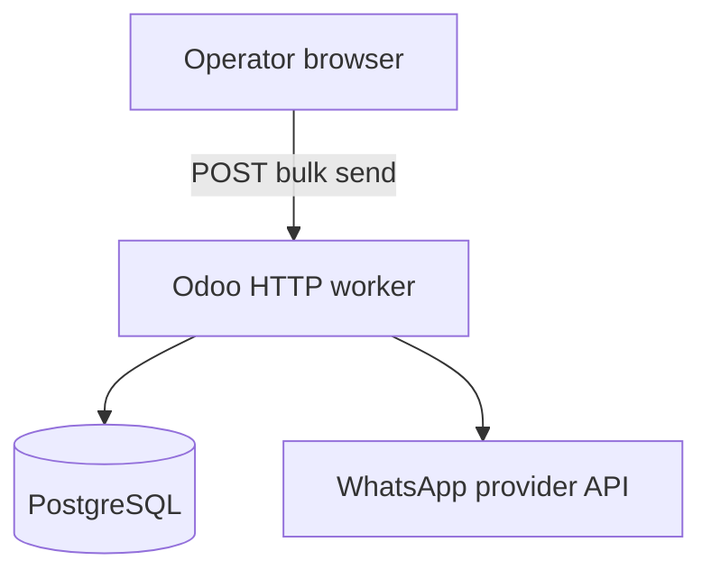

# Embedded Runtime (Current)

[← Documentation index](../README.md)

Production deployment model for RelayRuntime **today**: all execution logic runs inside the Odoo process handling the bulk send request.

---

## Topology



| Component | Role |
|-----------|------|
| Odoo | Orchestration UI + runtime loop |
| PostgreSQL | Campaigns, executions, logs, config |
| Provider API | External delivery |

There is **no** separate RelayRuntime daemon in this repository version.

---

## Request-scoped execution

1. Wizard submits bulk send.
2. Same HTTP request holds DB transaction (no mid-loop commit).
3. `WhatsAppBulkSender` iterates recipients synchronously.
4. `finish()` commits terminal state.

Implications:

- Bounded by `limit_time_real` and reverse proxy timeouts.
- Worker crash → possible rollback + stale execution (see recovery docs).

---

## Addons path

Repository layout:

```
relayruntime/                 # or whatsapp_simple/ locally
  apps/odoo/relayruntime/     # Odoo module
  runtime/                    # extraction placeholders
  docs/
```

`addons_path` must include:

```
/path/to/repo/apps/odoo
```

**Not** the repository root.

---

## Configuration surfaces

| Surface | Location |
|---------|----------|
| Provider tokens | WhatsApp Settings (`whatsapp.config`) |
| Safety limits | Config + constants |
| Logging | Odoo log + optional file |
| Workers / timeouts | `odoo.conf` |

---

## Scaling limits (honest)

| Limit | Detail |
|-------|--------|
| Horizontal bulk workers | Not a first-class feature |
| Background queue | Not implemented |
| Cross-instance lease | DB-only; validate under multi-worker |
| Campaign size | Practical cap from timeout + delay |

---

## When embedded is appropriate

- Single-tenant Odoo with operational messaging volume within timeout budget.
- Team accepts manual recovery playbooks.
- Provider is Green API or Mock for testing.

---

## Evolution

See [deployment-evolution.md](deployment-evolution.md) and [future-runtime-service.md](future-runtime-service.md).

---

## Related

- [runtime-boundaries.md](../architecture/runtime-boundaries.md)
- [execution-lifecycle.md](../architecture/execution-lifecycle.md)
- [operational-guidelines.md](../operations/operational-guidelines.md)
