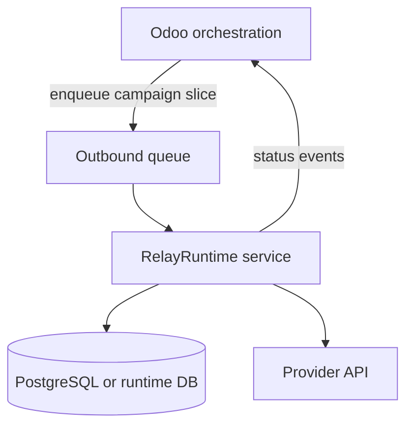

# Future Runtime Service

[← Documentation index](../README.md)

**Planned** architecture for a standalone RelayRuntime service. Nothing in this document describes shipped code unless explicitly marked.

---

## Intent

Separate **execution plane** from **Odoo orchestration** so that:

- bulk runs survive HTTP request boundaries
- workers scale independently (within honest limits)
- observability can centralize on the runtime

Odoo would enqueue work and display projection state—not own the recipient loop long-term.

---

## Conceptual topology (not implemented)

---

## API sketch (illustrative)

Future endpoints might include:

| Operation | Purpose |
|-----------|---------|
| `POST /executions` | Start execution with lease token |
| `POST /executions/{id}/heartbeat` | Liveness |
| `POST /executions/{id}/finish` | Terminal stats |
| `GET /executions/{id}` | Operator diagnostics |

Contracts must preserve idempotency keys and retry fingerprints from embedded era.

---

## Data ownership options

| Model | Tradeoff |
|-------|----------|
| Shared PostgreSQL | Simpler migration; coupling remains |
| Runtime-owned DB | Cleaner boundary; sync to Odoo |
| Event log + projection | Highest effort; best audit story |

Decision deferred until Phase D extraction ([future-extraction-strategy.md](../architecture/future-extraction-strategy.md)).

---

## Observability upgrades (planned)

- Structured logs with `execution_uuid`
- Metrics: in-flight executions, provider error rate, stale count
- Health checks for load balancers

Not available in embedded mode.

---

## Security (planned)

- Service-to-service auth (mTLS or signed tokens)
- No provider tokens in Odoo logs
- Scoped credentials per tenant in multi-tenant cloud vision

---

## What we will not claim at launch

- Exactly-once delivery
- Global active-active without split-brain design
- Replacement of provider compliance obligations

---

## Related

- [runtime-vision.md](../architecture/runtime-vision.md)
- [deployment-evolution.md](deployment-evolution.md)
- [future-extraction-strategy.md](../architecture/future-extraction-strategy.md)
