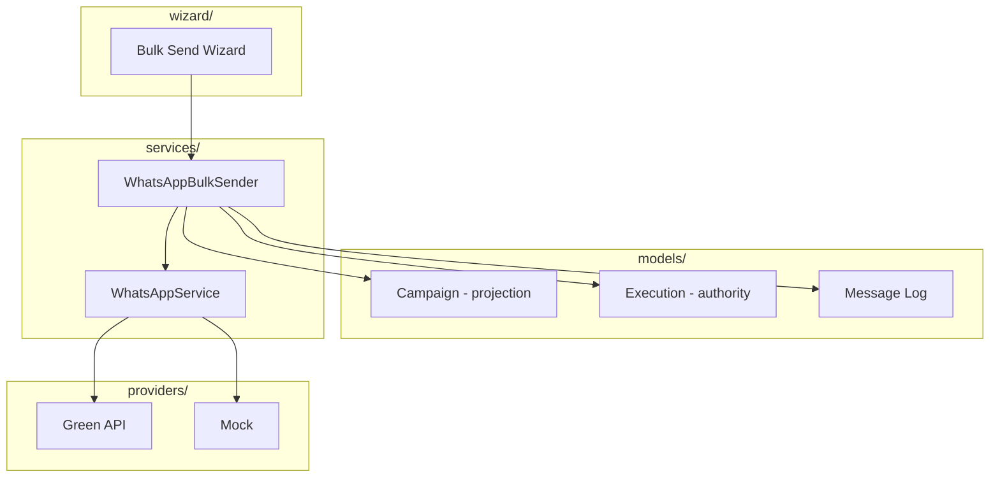

# Codebase Structure

[← Documentation index](../README.md)

## Module layout

```
whatsapp_simple/
├── __init__.py
├── __manifest__.py
├── constants.py              # Provider labels, execution timing constants
├── hooks.py                  # post_init_hook migrations
├── models/
│   ├── whatsapp_config.py
│   ├── whatsapp_bulk_campaign.py
│   ├── whatsapp_bulk_execution.py   # Runtime authority (19.0.5.5.0+)
│   ├── whatsapp_message_log.py
│   ├── whatsapp_delivery_dashboard.py
│   ├── res_partner.py
│   └── sale_order.py
├── wizard/
│   ├── whatsapp_bulk_send_wizard.py   # Primary bulk entry
│   ├── whatsapp_send_wizard.py        # Single send
│   └── whatsapp_product_selection_wizard.py
├── services/
│   ├── whatsapp_service.py            # Provider facade
│   ├── whatsapp_bulk_service.py       # Bulk orchestration
│   ├── whatsapp_product_service.py
│   ├── whatsapp_safety_utils.py
│   ├── whatsapp_phone_utils.py
│   ├── logger.py
│   ├── providers/                     # Adapter implementations
│   ├── webhook/                       # Skeleton only
│   └── exceptions/
├── views/                             # XML UI
├── security/
│   ├── whatsapp_security.xml
│   └── ir.model.access.csv
├── static/src/js/
│   └── campaign_monitor_kanban.js
├── tests/
├── docs/                              # Canonical documentation
└── scripts/                           # Dev registry checks
```

## Layer responsibilities



## Key classes

| Class | File | Role |
|-------|------|------|
| `WhatsAppBulkSender` | `whatsapp_bulk_service.py` | Recipient loop, provider calls |
| `WhatsAppBulkExecution` | `whatsapp_bulk_execution.py` | Lease, heartbeat, finish |
| `WhatsAppBulkCampaign` | `whatsapp_bulk_campaign.py` | Aggregate + retry action |
| `WhatsAppMessageLog` | `whatsapp_message_log.py` | Idempotency, intent flush |
| `WhatsAppSafetyValidator` | `whatsapp_safety_utils.py` | Limits, delays, MIME |
| `ProviderRegistry` | `provider_registry.py` | Adapter factory |

## Extension points

| Extension | Status |
|-----------|--------|
| New provider adapter | Implement `BaseWhatsAppProvider`, register in `PROVIDER_REGISTRY` |
| Webhook handler | Register on `WhatsAppWebhookRouter.HANDLER_REGISTRY` — **no HTTP route yet** |
| Cron bulk worker | **Not present** — would be new module area |

## Legacy documentation

| File | Status |
|------|--------|
| `docs/ARCHITECTURE.md` | Superseded by `docs/architecture/` — retained for links |
| `docs/PROVIDER_ARCHITECTURE.md` | Still valid for adapter details |

## Further reading

- [Provider Architecture](../PROVIDER_ARCHITECTURE.md)
- [ORM Guidelines](ORM_GUIDELINES.md)
