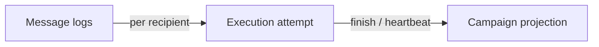

# Runtime Safety Rules

[← Documentation index](../README.md)

**Mandatory** guidance for any change touching bulk send, execution, logs, or providers.

## 1. No unsafe commits in loops

| Rule | Rationale |
|------|-----------|
| **Do not** call `env.cr.commit()` inside `WhatsAppBulkSender` recipient loops | Creates partial durable state on crash; breaks single-transaction integrity |
| **Do not** re-enable `_commit_progress` commits without architectural review | Same |
| Wizard pre-send commit **must not** return | Removed intentionally |

**Allowed:** `flush()` / `flush_recordset()` to order visibility within the open transaction.

## 2. No mutable execution truth without authority

| Authority | Owns |
|-----------|------|
| `whatsapp.bulk.execution` | Running state, lease, heartbeat, in-run counters |
| `whatsapp.bulk.campaign` | Projection for UI and historical summary |
| `whatsapp.message.log` | Per-recipient delivery truth |

| Rule | Detail |
|------|--------|
| **Do not** set `campaign.state = 'running'` without `begin_campaign_execution` | Bypasses lease |
| **Do not** clear `active_execution_id` while attempt still `running` | Orphan monitor state |
| **Do not** treat wizard `processing_state` as source of truth | Transient UI only |

## 3. No replay-unsafe writes

| Rule | Detail |
|------|--------|
| Preserve `idempotency_key` format or migrate explicitly | `campaign:{id}:partner:{id}` |
| **Do not** remove unique constraint without replacement | Duplicate sends |
| New execution attempts **must** use new `execution_uuid` | Never recycle UUID |
| Retry campaigns **must** keep fingerprint dedup | `(parent_campaign_id, retry_fingerprint)` |

Before provider I/O: call `commit_outbound_intent()` or equivalent flush path.

## 4. No hidden transaction boundaries

| Rule | Detail |
|------|--------|
| Document any new `commit()` or `rollback()` | In changelog and `/docs` |
| Subprocess / HTTP controller bulk entry **must** use same sender path | Consistent semantics |
| **Do not** spawn threads that call provider from another cursor without design | Undefined |

## 5. No duplicate-send risk introduction

| High-risk change | Review question |
|------------------|-----------------|
| New send entry point | Does it use idempotency + execution lease? |
| Weaker idempotency scope | Will retry or replay double-send? |
| Catch-all `except` that continues loop | Provider may have sent — is log terminal? |
| Re-raise after provider success | Causes rollback — forbidden without compensation |

Sender **returns stats** on fatal error after `finish()` — preserve this when editing exception paths.

## 6. Execution-attempt authority principles

| # | Principle |
|---|-----------|
| 1 | One execution row per HTTP bulk run |
| 2 | Lease must be acquired before first recipient |
| 3 | Heartbeat must run during long loops (throttled) |
| 4 | `finish()` or `reconcile` must clear lease |
| 5 | Campaign counters at end come from sender `stats` today — if changing, document drift risk |

## 7. Provider calls

| Rule | Detail |
|------|--------|
| All outbound traffic via `WhatsAppService` → registry | No direct Green API from models |
| Stub providers must keep `is_implemented = False` | Until actually built |
| Log failures with `failure_reason` / `api_response_body` | Operations depend on it |

## 8. Reconciliation

| Rule | Detail |
|------|--------|
| Stale thresholds live in `constants.py` | Single source |
| Reconcile before new runs | Wizard + retry + `begin_campaign_execution` |
| **Do not** reconcile to `completed` without evidence | Use `reconciled` / `failed` |

## Checklist for reviewers

- [ ] No `commit()` in bulk loop or progress helpers
- [ ] Execution begin/finish paired on all exit paths
- [ ] Idempotency preserved for campaign/partner
- [ ] Provider called only after intent flush
- [ ] Docs updated if behavior changed
- [ ] Tests or manual test plan referenced

## Further reading

- [Transaction Model](../architecture/TRANSACTION_MODEL.md)
- [Known Limitations](../architecture/KNOWN_LIMITATIONS.md)
- [Testing Strategy](../testing/TESTING_STRATEGY.md)
