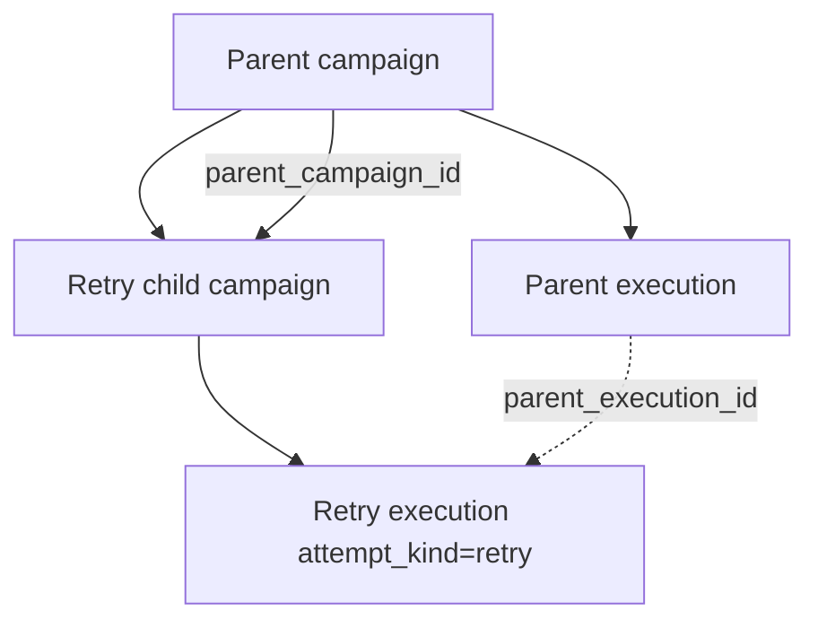

# Retry Lineage

[← Documentation index](../README.md)

How RelayRuntime models **retry campaigns** as a distinct execution branch with deduplication—not in-place resume of a failed loop.

---

## Lineage model

| Field | Purpose |
|-------|---------|
| `parent_campaign_id` | Business tree |
| `retry_fingerprint` | Dedup identical retry requests |
| `parent_execution_id` | Links to latest parent execution at retry time |
| `attempt_kind` | `initial` vs `retry` on execution |

---

## Retry creation flow

1. Operator selects failed/skipped logs on parent campaign.
2. System computes `retry_fingerprint` from parent id + log id set (+ version salt if present).
3. If fingerprint exists → reject duplicate retry.
4. Create child campaign copying message/config scope.
5. On send, `begin_campaign_execution` with `attempt_kind=retry`.

---

## Idempotency scope

Idempotency key: `campaign:{campaign_id}:partner:{partner_id}`.

**Important:** Child campaign has **new** `campaign_id`. Partners retried will **send again** unless business rules exclude them—by design for “retry failed recipients.”

Parent campaign logs remain historical; child builds new logs.

---

## Fingerprint guarantees

| Guaranteed | Not guaranteed |
|------------|----------------|
| Same log set + parent → one retry campaign row | Operator cannot force second identical retry UI action |
| Unique DB constraint on fingerprint | Semantic dedup across different log selections |
| Lineage fields populated | Automatic merge of parent/child stats |

---

## Operational guidance

| Do | Don't |
|----|-------|
| Review failed logs before retry | Retry entire parent without filtering |
| Note child campaign id in tickets | Assume retry is idempotent across campaigns |
| Use Mock Provider to validate fingerprint | Delete parent before child completes |

---

## Future extraction

Fingerprint and lineage validation move to `runtime/retry/` per [future-extraction-strategy.md](../architecture/future-extraction-strategy.md).

---

## Related

- [execution-lifecycle.md](../architecture/execution-lifecycle.md)
- [replay-recovery.md](replay-recovery.md)
