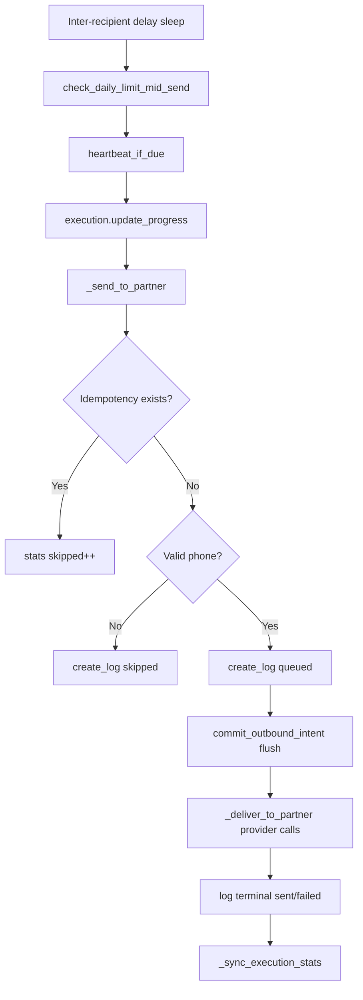

# Execution Flow

[← Documentation index](../README.md) · [Execution Runtime](../architecture/EXECUTION_RUNTIME.md)

Step-by-step runtime path for a **bulk send** (primary complex flow). Single send omits campaign/execution layers.

## Entry points

| Entry | Model / method | Execution layer |
|-------|----------------|-----------------|
| Contacts → Bulk Send | `whatsapp.bulk.send.wizard.action_send` | Yes |
| Campaign → Retry Failed | `whatsapp.bulk.campaign.action_retry_failed_recipients` | Yes |
| Contact / SO single send | `whatsapp.send.wizard` | No execution row |

## Phase 0 — Pre-flight

1. `_reconcile_stale_executions()` and `_reconcile_stale_running_campaigns()`.
2. Load active `whatsapp.config` for company.
3. Wizard validation: recipients, payload, MIME types, product images, daily limit (planned sends).
4. Create `whatsapp.bulk.campaign` in `draft`.
5. Instantiate `WhatsAppBulkSender(env, config, campaign, wizard=…)`.

## Phase 1 — Preparation

1. `validate_configuration()` on provider facade.
2. Build product send plan if products selected (`WhatsAppProductService.prepare_send_plan`).
3. Sort partners; `validate_unique_recipients`.
4. Batch-read partner phones (`_batch_prepare_partners`).
5. `check_daily_limit(planned_sends=…)`.

## Phase 2 — Execution start

1. `campaign._mark_running(total)` → delegates to `begin_campaign_execution`.
2. Row lock + lease check + create `whatsapp.bulk.execution`.
3. Campaign projected to `running`.

## Phase 3 — Recipient loop

For each prepared partner row:

### Per-recipient delivery (`_deliver_to_partner`)

Order of provider operations:

1. Catalog/text message (if applicable)
2. Free attachments (sequential, with attachment delay sleep)
3. Product images (if enabled, with delays)

Each segment calls `WhatsAppService` → provider adapter.

## Phase 4 — Termination

| Outcome | Handler |
|---------|---------|
| Normal completion | `execution.finish(stats, stopped=False)` |
| Daily limit (`ValidationError`) | `execution.finish(stats, stopped=True)`; returns stats (no re-raise) |
| Other exception | `execution.finish(stats, failed=True)`; returns stats |

HTTP request commits if Odoo completes request without unhandled exception.

## Phase 5 — UI feedback

Wizard writes summary fields and returns `display_notification` client action.

Campaign Monitor kanban reloads every **5 seconds** via JS (`campaign_monitor_kanban.js`) while users watch progress.

## Blocking operations (implemented)

| Operation | Location | Effect |
|-----------|----------|--------|
| Inter-recipient delay | `get_random_delay()` | `time.sleep` |
| Attachment delay | `get_attachment_delay()` | `time.sleep` |
| Cooldown | `apply_cooldown_if_needed` | `time.sleep` per config |
| Provider HTTP | Green API / Mock | Blocks until response/timeout |

## What does not run

- Module cron jobs for sending
- Queue consumers
- Webhook-driven outbound triggers

## Further reading

- [Retry and Replay](RETRY_AND_REPLAY.md)
- [Outbound Intents](OUTBOUND_INTENTS.md)
- [Transaction Model](../architecture/TRANSACTION_MODEL.md)
