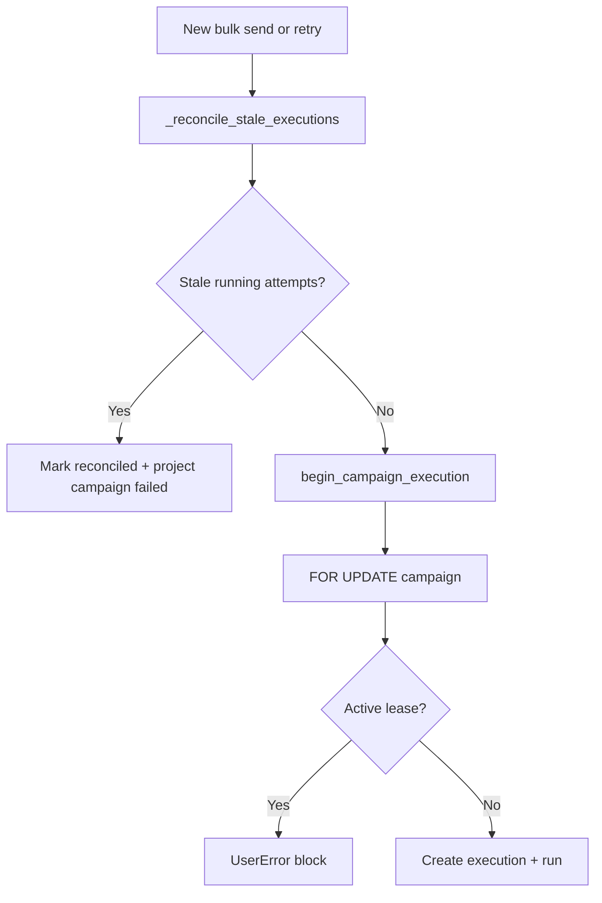

# Heartbeat and Leases

[← Documentation index](../README.md) · [Execution Runtime](../architecture/EXECUTION_RUNTIME.md)

## Lease ownership

| Field | Purpose |
|-------|---------|
| `lease_token` | Opaque UUID identifying the active executor claim |
| `lease_expires_at` | Wall-clock expiry; extended on heartbeat |
| `executor_uid` | `res.users` who started the run |

**Implemented rule:** `begin_campaign_execution` refuses to start if another attempt on the same campaign has `state=running` and `lease_expires_at > now`.

**Campaign mirror:** `execution_token` = `execution_uuid`, `execution_lock_expires_at` = lease expiry while running.

## Heartbeat intervals

Configured in `constants.py`:

| Setting | Value |
|---------|-------|
| Recipients between forced index checks | Every **5** (`EXECUTION_HEARTBEAT_EVERY_N_RECIPIENTS`) |
| Minimum seconds between heartbeats | **45** (`EXECUTION_HEARTBEAT_MIN_INTERVAL_SECONDS`) |
| Lease extension per heartbeat | **15** minutes (`EXECUTION_LEASE_MINUTES`) |

### Decision logic (`heartbeat_if_due`)

```
if state != running: skip
if force (index == 0): heartbeat
elif index % 5 == 0: eligible
elif now - heartbeat_at >= 45s: eligible
else: skip
```

## Stale detection

**Threshold:** 30 minutes (`EXECUTION_STALE_MINUTES`) without fresh `heartbeat_at` (or `started_at` if heartbeat never set).

**Method:** `_reconcile_stale_executions()`

**Resulting execution state:** `reconciled`

**Campaign effect:** if `active_execution_id` matches, campaign → `failed` with partial progress preserved.

### False-positive risk (partially mitigated)

| Scenario | Risk |
|----------|------|
| Very slow loop, no heartbeat for 30+ min | May reconcile while process still alive |
| Long provider timeout without progress writes | Heartbeat may not refresh if index/time gates not met |
| Legitimate 1000+ recipient run | Must complete or refresh within 30 minutes |

**Mitigation (partial):** time-based 45s heartbeat can fire even off 5th index.

## Reconciliation flow



Called from:

- Bulk wizard `action_send`
- Campaign `action_retry_failed_recipients`
- Inside `begin_campaign_execution` (double-call safe)

## Lease release

| Event | Lease fields |
|-------|--------------|
| `execution.finish()` | Cleared |
| `_reconcile_stale_executions()` | Cleared |
| Unhandled rollback | Cleared only if transaction commits reconcile in separate request |

## Further reading

- [Runbook](../operations/RUNBOOK.md)
- [Known Limitations](../architecture/KNOWN_LIMITATIONS.md)
