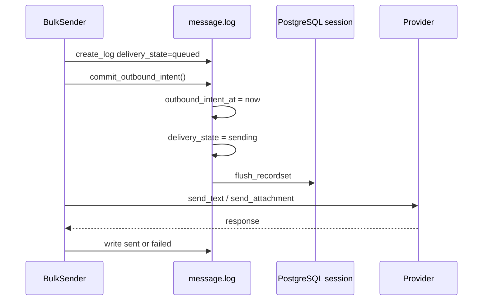

# Outbound Intents

[← Documentation index](../README.md) · [Transaction Model](../architecture/TRANSACTION_MODEL.md)

## Purpose

Reduce ambiguity between **database intent to send** and **irreversible provider I/O** by persisting log state and flushing ORM state before HTTP calls.

**Status:** **Partially implemented** — uses `flush()` within the open transaction, not an independent commit or outbox table.

## Delivery flow per recipient

## `commit_outbound_intent()` (implemented)

Location: `models/whatsapp_message_log.py`

Actions:

1. Set `outbound_intent_at` to current datetime.
2. If `delivery_state == 'queued'`, promote to `sending`.
3. `flush_recordset` on `delivery_state`, `outbound_intent_at`, `execution_id`, `idempotency_key`.

## Fields involved

| Field | When set |
|-------|----------|
| `idempotency_key` | Log create |
| `execution_id` | Log create (links to active attempt) |
| `outbound_intent_at` | Before first provider call |
| `delivery_state` | `queued` → `sending` → `sent`/`failed`/`skipped` |
| `api_message_id` | After successful text segment (if returned) |

## What flush guarantees

| Guaranteed | Not guaranteed |
|------------|----------------|
| Same-transaction readers see intent | Survives process kill before HTTP commit |
| Ordering before provider call in code path | Provider cannot see Odoo intent |
| Reduces "no log at all" window vs old path | Eliminates duplicate send on rollback |

## Crash windows (remaining)

| Crash point | Likely DB state after crash | Provider |
|-------------|----------------------------|----------|
| After create, before flush | May rollback entire request | Not called |
| After flush, before provider | Uncommitted until request end | Not called |
| After provider success, before terminal write | Uncommitted or partial on rollback | May have sent |
| After terminal write, before request commit | Lost if rollback | May have sent |

## Duplicate-send interaction

If `idempotency_key` row exists from a prior **committed** request, recipient is skipped before intent creation.

If prior request **rolled back**, no key survives → retry may call provider again.

## Planned / future

- Transactional outbox row committed before provider worker
- Provider-specific idempotency keys stored on log
- Savepoint release per recipient (explicit tradeoff document)

## Further reading

- [Execution Flow](EXECUTION_FLOW.md)
- [Runtime Failure Tests](../testing/RUNTIME_FAILURE_TESTS.md)
