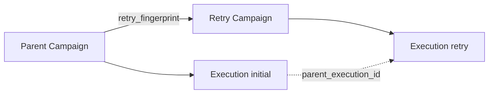

# Retry and Replay

[← Documentation index](../README.md) · [Data Model](../architecture/DATA_MODEL.md)

## Retry semantics (implemented)

### User action

**Retry Failed Recipients** on `whatsapp.bulk.campaign` when:

- Campaign is not actively running with a valid lease, and
- At least one log exists with `delivery_state` in `failed` or `skipped` and a partner.

### Retry campaign creation

1. Collect partners from qualifying logs.
2. Compute `retry_fingerprint` (SHA-1).
3. If child campaign exists with same `(parent_campaign_id, retry_fingerprint)` → open existing form (no duplicate tree).
4. Else create child campaign copying message, attachments, products, flags, and recipient subset.
5. Immediately run `WhatsAppBulkSender.send_to_partners` on the retry campaign.

### Execution lineage on retry

| Field | Value |
|-------|-------|
| `campaign.parent_campaign_id` | Original campaign |
| `campaign.retry_fingerprint` | Dedup key |
| `execution.attempt_kind` | `retry` |
| `execution.parent_execution_id` | Latest execution on parent campaign |

Each retry **run** is a new execution row, not a resume of the parent execution.

## Replay behavior

| Replay type | Behavior |
|-------------|----------|
| Re-click retry with same fingerprint | Opens existing retry campaign; **does not** auto-resend unless user triggers send again on that campaign |
| Re-run bulk on same campaign | **Blocked** if active lease exists |
| Re-run after reconcile | New execution allowed; idempotency may skip partners already logged |

**Not implemented:** automatic resume from `last_recipient_index`.

## Deduplication behavior

| Layer | Key / rule | Scope |
|-------|------------|-------|
| Retry campaign | `(parent_campaign_id, retry_fingerprint)` unique | Same parent + same payload |
| Recipient send | `campaign:{id}:partner:{id}` unique | Same campaign |
| Execution lease | One valid `running` lease per campaign | Concurrent runs |

## Lineage semantics

**Canonical parent for execution:** latest execution on `parent_campaign_id`, not necessarily the execution that produced the failed logs.

**Implication:** if multiple executions existed on parent (only one expected today), lineage pointer is "latest by id desc", not causal per log.

## Known replay limits

| Limit | Detail |
|-------|--------|
| Cross-campaign resend | Retry **intentionally** creates new campaign → new idempotency namespace |
| Fingerprint change | Edited parent content → new retry campaign allowed → potential duplicate business messages |
| Provider-level replay | No Odoo control over provider retries |
| HTTP rollback replay | Provider may have sent; DB has no log → manual retry may duplicate |
| `sending` zombie logs | Reconcile does not auto-retry; idempotency may block if key exists |
| Concurrent fingerprint race | Two tabs may race create; one wins on unique constraint |

## Planned / future

- Explicit `origin_log_ids` on retry campaigns
- Attempt-scoped idempotency for safe resume
- User confirmation before resend when provider state unknown

## Further reading

- [Execution Flow](EXECUTION_FLOW.md)
- [Known Limitations](../architecture/KNOWN_LIMITATIONS.md)
- [Runbook](../operations/RUNBOOK.md)
